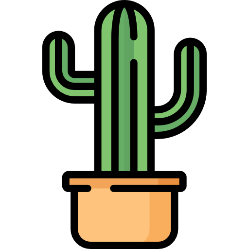

 

The CACTus project is a collection of tools for Computer-Assisted Composition, centered around the OM# visual programming environment.

&rarr; **[OM#](om-sharp/)**    
&rarr; More projects and repositories: [https://github.com/cac-t-u-s](https://github.com/cac-t-u-s)

-------
Contact & info [https://j-bresson.github.io](https://j-bresson.github.io)

