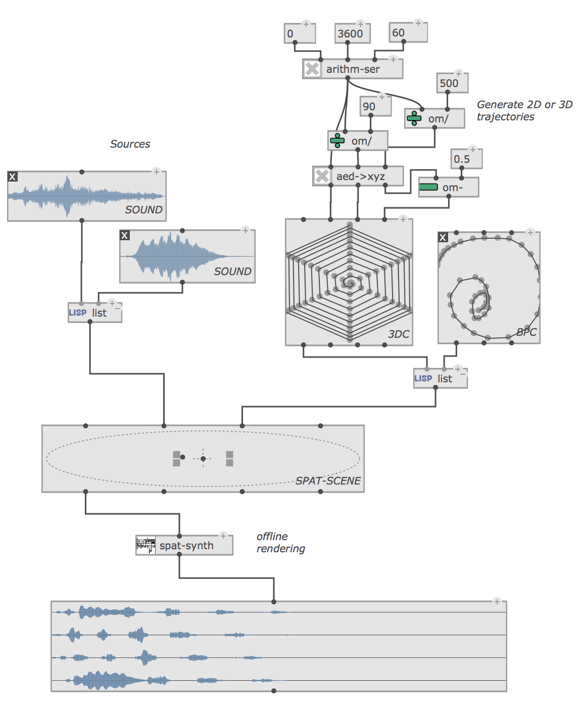

**OM#** (om-sharp) is a computer-assisted composition environment derived from [OpenMusic](http://repmus.ircam.fr/openmusic/): a visual programming language dedicated to musical structure generation and processing.
The environment is based on [Common Lisp](http://www.gigamonkeys.com/book/introduction-why-lisp.html), and allows creating programs that are interpreted in this language. Visual programs are made by assembling and connecting icons ("boxes") representing Lisp functions and data structures, built-in control structures (e.g. loops), and other program constructs. The visual language can be used for general-purpose programming, and reuse any existing Common Lisp code. A set of built-in tools, editors, and libraries (including common music notation, MIDI, 2D/3D curves, audio...) make it a powerful environment for music composition.

------

### Download

&rarr; OM# is available on [macOS, Windows, and Linux](https://github.com/cac-t-u-s/om-sharp/releases/latest)

------

> ### [Documentation](./pages/index)

-------

### What's new ?

&nbsp;&nbsp;&nbsp;

&nbsp;&nbsp;&nbsp;

**OM#** includes a new generation of tools and features in your computer-assisted composition environment:

- [Patching interfaces and environment](pages/patch) with easier box inspection / display control / automatic alignment / connections / etc.
- [No workspace](pages/doc-management) to set-up: open your documents and simply organize them in your usual file-system.
- Interactive visualization of [Lisp code](pages/lisp#getting-the-equivalent-lisp-code-of-a-patch) corresponding to visual programs.
- A native implementation of the [reactive mode](pages/reactive) for visual program execution.
- New [loops](pages/loop). Embed iterative processes in standard patches. Use a collection of new collectors and memory utilities.
- A set of [interface components](pages/interface-boxes): list-selection, switch, button, slider, ... / Lock your patch for faster interaction.
- A redesigned [sequencer](pages/sequencer) interface including dual program/tracks-based visualization, meta-programming tools, and reactive execution modes.
- Human-readable, easily [editable text format](pages/doc-management#file-format) for patches and other documents. Possibility to read and edit patches as text.
- New **score editors**, BPF/BPC editors, etc. Nicer display. Easier edit.
- Versatile [containers](pages/store-collect) handling the storage, visualization and editing of collection of objects.
- A [time-based model](pages/time-sequence) for "executable" objects, including dynamic function execution and data send/transfer possibility.
- Dynamic-memory allocated [audio buffers](pages/sound).
- Tools and editors for the representation and manipulation of musical objects (score, [sounds](pages/sound), [MIDI tracks](pages/midi-track), ...)
- A framework for handling [OSC structures and communication](pages/osc)
- ...

&rarr; See also this <a href="https://hal.archives-ouvertes.fr/hal-01567619" target="_blank">ICMC paper</a> (2017) for a quick overview.

------

### Help | Bug reports | Community

**See the [`om-sharp-users`](https://github.com/cac-t-u-s/om-sharp-users) repository.**     
&rarr; Use the [Issue Tracker](https://github.com/cac-t-u-s/om-sharp-users/issues) to report problems, suggest features or enhancements, or just discuss about the project !

------

### Sources

OM# is a free software distributed under the GPLv3 license.

&rarr; Source repository: <https://github.com/cac-t-u-s/om-sharp/>

As a Common Lisp program, OM# can be considered just as an extension of Lisp including the specific built-in features of the application.
The application is developed with the latest [LispWorks](http://www.lispworks.com/) compiler (7.1.2), which provides multi-platform support and graphical/GUI toolkits in Common Lisp.
A limited "Personal" edition of LispWorks 7 is now available: its limited heap size requires compiling sources in several successive runs, and it is not possible to create new OM# executables with it, however, it allows loading and running/using/editing the program from its sources.

Alternatively, the OM# executable also includes a Lisp interpreter which can load and evaluate modifications and extensions of the program sources.

------

### Compatibility

OM# can load patches created in OpenMusic. See [how to import OpenMusic patches](pages/import-from-om).
Most OpenMusic external libraries are easily portable (or already ported). See [how to create or adapt a library](pages/write-library).
Report any problems in porting or converting libraries or patches on the discussion forum (see below).

------

### Externals | Libraries

External libraries are packages containing additional pieces of code that can be loaded dynamically in an OM# session. There exist a few specific libraries distributed here (see list below), as well as a number of compatible OpenMusic libraries.

> OM# [external libraries](pages/libraries) are structured as a simple folder, called either "libname" or "libname x.y" (where "libname" is the name of the library, and "x.y" is a version number), containing a loader file named **libname.olib** (or .omlib).

> &rarr; Unzip the external libraries in a common container directory and specify directory in the Preferences/Libraries/

<table align="right">
<tr>
<th colspan="4">OM# libraries</th>
</tr>
<tr>
<td>
  <B><a href="https://github.com/cac-t-u-s/csound/releases" target="_blank">csound</a></B>
   
  A simple interface with the Csound synthesis language. 
</td>
<td>
  <B><a href="https://github.com/cac-t-u-s/o.OM/releases" target="_blank">odot</a></B>
   
  Support for OSC encoding/decoding usnig CNMAT's libo library and "o." expression language.
</td>
<td>
  <B><a href="https://github.com/cac-t-u-s/spat/releases" target="_blank">spat</a></B>
   
  A connection with IRCAM's Spat library for spatial audio control and rendering. 
</td>
<td>
  <B><a href="https://github.com/cac-t-u-s/mathtools/releases" target="_blank">mathtools</a></B>
   
  An adaptation of OpenMusic's "Mathtools" package for mathematical music analysis and representations. 
</td>
</tr>
</table>

<table>
<tr>
<th colspan="4" align="center">Compatible OpenMusic libraries</th>
</tr>

<tr>
<td colspan="2">
<i>"Classics"</i>
</td>
<td>
<i>Externals/DSP tools</i>
</td>
<td>
<i>Third-party</i>
</td>
</tr>

<tr>
<td>
<ul>
  <li> <a href="https://github.com/openmusic-project/Repmus" target="_blank">Repmus</a></li>
  <li> <a href="https://github.com/openmusic-project/Chaos" target="_blank">Chaos</a></li>
  <li> <a href="https://github.com/openmusic-project/Alea" target="_blank">Alea</a></li>
  <li> <a href="https://github.com/openmusic-project/Esquisse" target="_blank">Esquisse</a></li>
  <li> <a href="https://github.com/openmusic-project/Profile" target="_blank">Profile</a></li>
  <li> <a href="https://github.com/openmusic-project/LZ" target="_blank">LZ</a></li>
  <li> <a href="https://github.com/openmusic-project/Filters" target="_blank">Filters</a></li>
</ul>
</td>

<td>
<ul>
  <li> <a href="https://github.com/openmusic-project/Combine" target="_blank">Combine</a></li>
  <li> <a href="https://github.com/openmusic-project/Patterns" target="_blank">Patterns</a></li>
  <li> <a href="https://github.com/openmusic-project/Morphologie" target="_blank">Morphologie</a></li>
  <li> <a href="https://github.com/openmusic-project/OMTimePack" target="_blank">OMTimePack</a></li>
  <li> <a href="https://github.com/openmusic-project/OMCS" target="_blank">OMCS</a></li>
  <li> <a href="https://github.com/openmusic-project/OMRC" target="_blank">OMRC</a></li>
  <li> <a href="https://github.com/openmusic-project/omchroma" target="_blank">OMChroma</a></li>
</ul>
</td>

<td>
<ul>
  <li> <a href="https://github.com/openmusic-project/om-supervp" target="_blank">OM-SuperVP</a></li>
  <li> <a href="https://github.com/openmusic-project/om-pm2" target="_blank">OM-pm2</a></li>
  <li> <a href="https://github.com/openmusic-project/om-chant" target="_blank">OM-Chant</a></li>
  <li> <a href="https://github.com/openmusic-project/om-xmm" target="_blank">OM-XMM</a></li>
  <li> <a href="https://github.com/DYCI2/om-dyci2" target="_blank">OM-Dyci2</a></li>
</ul>
</td>

<td>
<ul>
  <li> <a href="https://github.com/andersvi/omai" target="_blank">OMAI</a></li>
  <li> <a href="https://github.com/charlesneimog/OM-JI" target="_blank">OM-JI</a></li>
</ul>
</td>

</tr></table>

------

### Publications

About the general design and implementation of OM#:

  * [Score Objects in OM#](https://hal.archives-ouvertes.fr/hal-03221785/document). Jean Bresson. International Conference on Technologies for Music Notation and Representation (TENOR’20/21), Hamburg, Germany (online), 2021.
  * [Next-generation Computer-aided Composition Environment: A New Implementation of OpenMusic](https://hal.archives-ouvertes.fr/hal-01567619/document). Jean Bresson, Dimitri Bouche, Thibaut Carpentier, Diemo Schwarz, Jérémie Garcia. International Computer Music Conference (ICMC’17), Shanghai, China, 2017.
  * [Timed Sequences: A Framework for Computer-Aided Composition with Temporal Structures](https://hal.archives-ouvertes.fr/hal-01484077/document). Jérémie Garcia, Dimitri Bouche, Jean Bresson. International Conference on Technologies for Music Notation and Representation (TENOR’17), A Coruña, Spain, 2017.
  * [Computer-aided Composition of Musical Processes](https://hal.archives-ouvertes.fr/hal-01370792/document). Dimitri Bouche, Jérôme Nika, Alex Chechile, Jean Bresson. Journal of New Music Research, 46(1), 2017.

OM# was also used as a support for research and production in a number of other projects:

  * [Composing Structured Music Generation Processes with Creative Agents](https://hal.archives-ouvertes.fr/hal-02126847). Jérôme Nika, Jean Bresson. Joint Conference on AI Music Creativity (AIMC 2021), Graz, Austria (online), 2021.
  * [Instrumental Radiation Patterns as Models for Corpus-Based Spatial Sound Synthesis: Cosmologies for Piano and 3D Electronics](https://hal.archives-ouvertes.fr/hal-03348826). Aaron Einbond, Jean Bresson, Diemo Schwarz, Thibaut Carpentier. International Computer Music Conference (ICMC), Pontificia Universidad Católica de Chile (online), 2021.
  * [OM-AI: A Toolkit to Support AI-Based Computer-Assisted Composition Workflows in OpenMusic](https://hal.archives-ouvertes.fr/hal-02126847). Anders Vinjar, Jean Bresson. Sound and Music Computing conference (SMC'19), Málaga, Spain, 2019.
  * [Musical Gesture Recognition Using Machine Learning and Audio Descriptors](https://hal.archives-ouvertes.fr/hal-01839050). Paul Best, Jean Bresson, Diemo Schwarz. International Conference on Content-Based Multimedia Indexing (CBMI'18), La Rochelle, France, 2018.
  * [From Motion to Musical Gesture: Experiments with Machine Learning in Computer-Aided Composition](https://hal.archives-ouvertes.fr/hal-01815988/document). Jean Bresson, Paul Best, Diemo Schwarz, Alireza Farhang. Workshop on Musical Metacreation (MUME2018), International Conference on Computational Creativity (ICCC’18), Salamanca, Spain, 2018.
  * [Symbolist: An Open Authoring Environment for End-user Symbolic Notation](https://hal.archives-ouvertes.fr/hal-01804933/document). Rama Gottfried, Jean Bresson. International Conference on Technologies for Music Notation and Representation (TENOR'18), Montreal, Canada, 2018.
  * [Landschaften – Visualization, Control and Processing of Sounds in 3D Spaces](https://hal.archives-ouvertes.fr/hal-01567629/document). Savannah Agger, Jean Bresson, Thibaut Carpentier. International Computer Music Conference (ICMC’17), Shanghai, China, 2017.
  * [Interactive-Compositional Authoring of Sound Spatialization](https://hal.inria.fr/hal-01467080/document). Jérémie Garcia, Thibaut Carpentier, Jean Bresson. Journal of New Music Research, 46(1), 2017.
  * [o.OM: Structured-Functional Communication between Computer Music Systems using OSC and Odot](https://hal.archives-ouvertes.fr/hal-01353794/document). Jean Bresson, John MacCallum, Adrian Freed. ACM SIGPLAN Workshop on Functional Art, Music, Modeling & Design (FARM’16), Nara, Japan, 2016.
  * [Towards Interactive Authoring Tools for Composing Spatialization](https://hal.archives-ouvertes.fr/hal-01108709/document). Jérémie Garcia, Jean Bresson, Thibaut Carpentier. IEEE 10th Symposium on 3D User Interfaces (3DUI), Arles, France, 2015.

------

### Contributing coffee

Support the development of OM#: [Buy me a coffee!](https://www.buymeacoffee.com/cactus.jb)

-------

### Credits | Contacts

Design and development: J. Bresson, with contributions by D. Bouche, J. Garcia, A. Vinjar, and other [contributors](https://github.com/cac-t-u-s/om-sharp/graphs/contributors).
This project uses code and features from the [OpenMusic](https://github.com/openmusic-project/openmusic/) project by IRCAM - STMS lab.

Contact: [https://j-bresson.github.io](https://j-bresson.github.io)
