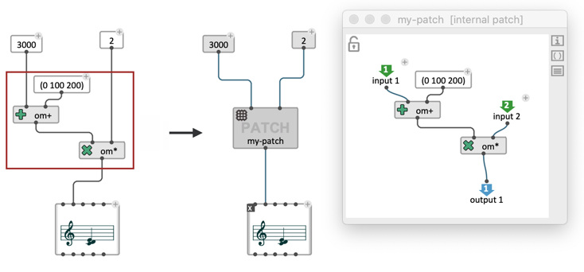
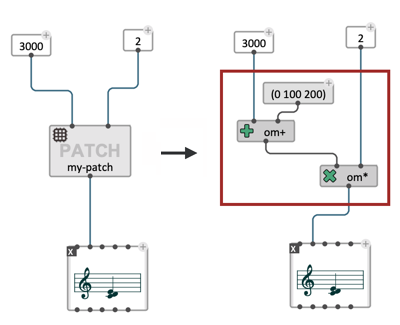
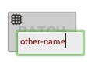
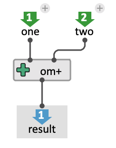
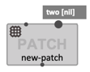
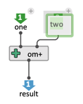
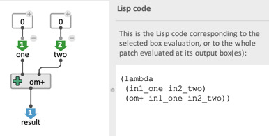
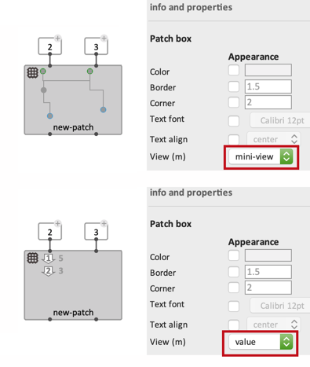

# Abstractions

> Abstraction is a fundamental concept in computer programming, which can have different meanings and facets. In our case, making an abstraction consists in using parts of visual programs as functions (or _procedures_, _sub-routines_, etc.) in order to single out a specific behaviour or sequence of operations, which can be labeled with a name and eventually used/re-used in a larger-scale program. 
There can be arbitrary numbers of levels of abstraction and encapsulation of patches within one another.     
Abstraction allows to structure a program by establishing levels of complexity, reuse components, and focus on certain levels of details when programming.
It quickly becomes an essential part of writing consistent programs in any language.

**In OM# (and similar visual programming languages), abstractions are patches embedded inside other higher-level patches.**
These patches can be either **[global](#global-abstraction)** or **[internal](#internal-abstraction)**.

_— In this page we will concerntrate on the case of standard patches, however the same abstraction concepts apply to [maquettes](sequencer), or [Lisp functions](lisp-function)._

#### Contents of this page:

- [Global Abstraction](#global-abstraction)
- [Internal Abstraction](#internal-abstraction)
- [In / Out](#in--out)
- [Abstraction Boxes](#abstraction-box)
  - [Display](#display)
  - [Evaluation](#evaluation)

------

## Global Abstraction

**A global abstraction is a patch that exists as a file/document on its own, included in another patch.**

To include a patch in another patch, you can use one of the following options:

1. Drag the **.opat** file from your system Desktop manager.
2. Use the menu "Box/Add Box/External abstraction", click somewhere in the container patch and select a .opat file from the file-chooser dialog. 
3. Type <kbd>P</kbd> and enter the name or full pathname of the patch file.

 

In (3) either the name of the file or its _pathname_ (i.e. file location, with folders separated by a "/") can be specified. The search locations are:

- The folder where the current container patch is located.
- The "search path" specified in the "File and folders" [preferences](preferences).

 

### Finding / changing the location of an abstraction

> Global abstractions are convenient as they allow a same file to be reused at several places in a same program. They are the true way of dealing with modularity in a program, since they are really independant of their caller environment and context. 
>
> The drawback is that they need to be always reachable and found, and the relative-pathname link and be easily broken by simply moving or renaming the patch file.

The full reference pathname of an abstraction box can be read in the [inspector panel](inspector).

 

This pathname can be changed or edited: if it is changed to another existing file, the patch box will now make reference to this new abstaction.

A patch box with lost abstraction will display in red, as well as the pathname field in the inspector panel. Use this field to edit and restore the abstraction pathname.

 

> In order to avoid loosing tracks of abstractions, patches and dependencies should either be moved and transfered jointly in a same folder, or placed in the search path specified in the "File" [Preferences](preferences).

### Copies and multiple references

A global abstraction points to a unique function defined by the referenced document.    
As a consequence, **all the instances and copies of a global abstraction point to the same reference**.

### Save

Save modifications in a patch editor using the standard command <kbd>Ctrl/⌘</kbd> + <kbd>S</kbd>.   
&rarr; Saved changes will apply to all the abstraction boxes referring to this patch.

> If the patch itself contains global abstractions pointing to other patches, **saving the patch will _not_ save changes in the patches pointed by these abstraction boxes**.

### Internalize

**Convert a global abstraction to a local abstraction using the menu "Boxes/Interanlize abstraction(s)" or the keyborad shortcut** <kbd>A</kbd>.

> Internalizing a global abtraction box makes a local copy of the reference patch and attaches it to the box.    
The link to the original reference is then broken.

------

## Internal Abstraction

**An internal abstraction is a patch defined and embedded _inside_ another patch**: it is stored inside its container patch and not as a standalone document. 

To create an internal patch in another patch, you can use one of the following options:

1. Type "patch", or "p" in the same text field you would use to type a function or class name (displayed with double-click or using the <kbd>N</kbd> keyboard shortcut).     
 
2. Use the menu "Box/Add Box/Internal patch", then click somewhere in the container patch to create the new patch box.
3. Encapsulate some boxes that are already in the container patch, using <kbd>shift</kbd> + <kbd>E</kbd> (see paragraph below).
     

> #### Encapsulation
>
> **Encapsulation creates an internal abstraction from selected boxes in a patch.**     
> Every connection excluded from the encapsulation becomes input or an output of the abstraction.    
>
> To encapsulate selected boxes, use the corresponding "Boxes / Encapsulate selection" menu or the <kbd>shift</kbd> + <kbd>E</kbd> shortcut.
>
>  
> 
> The inverse mechanism ("un-encapsulation") can be used to remove an abstraction and include its contents in the containing patch.     
> To un-encapsulate an abstraction, use the "Boxes / Unencapsulate selection" menu or the <kbd>shift</kbd> + <kbd>U</kbd> shortcut.
>
>  

### Renaming an internal patch

Internal patch are not bound to any external reference and therefore can be renamed at anytime without any consequence on the execution.    
There are two ways of changing the name of an internal abstraction:
1. Double-click on the name text-field on the box.     
 
2. Use the "Name" property in the [inspector panel](inspector).     

### Copies and multiple references

An internal abstraction refers to a function that is defined locally.   
As a consequence, **each copy of an internal abstraction box points to a new copy of the reference**. 
Copies do _not_ maintain any link (except if they contain common [global abstractions](#global-abstraction)!)

### Save

Changes to an internal patch can not be saved locally, as the patch does not correspond to a file on the disk.    
&rarr; **The "Save" command <kbd>Ctrl/⌘</kbd> + <kbd>S</kbd> in an internal patch will apply to its container document.** 

> If the patch is encapsulated in multiple successive abstractions, the "Save" command applies to the first global patch/document in the stack of containers. 

### Externalize / Save internal patch as a new file

The "File / Externalize" menu or the <kbd>Ctrl/⌘</kbd> + <kbd>shift</kbd> + <kbd>S</kbd> shortcut (similar to "Save as...") allow you to create a new file on the disk corresponding to the edited internal abstraction, and attach the corresponding box to the newly created patch.   
&rarr; **The box becomes a _global_ abstraction.**

------

## In / Out

> In functional programming languages, it is common to define abstraction as turning one or several terms of a function into variables.    
> For instance, let's consider the Lisp expression `(+ 5 1)`. If _5_ is turned into a variable _x_, then this expression becomes the function _f(x) = x + 1_ ; or in the Lisp syntax, the _lambda expression_ `(lambda (x) (+ x 1))`, which adds 1 to its input (or "argument").      
> When the functions called (or _applied_) in a given context, each variable (argument) is _bound_ to a value coming from this context.
>
> In OM#, abstraction are internally compiled into Lisp functions. **Turning a patch into an abstraction requires including in this patch _at least one "output" box_, determining the result or return value(s) of the abstraction, and a number (0 or more) "input" boxes, determining the inputs or arguments (or in other words, the _variables_ of the abstraction).**

In order to include an input or output in a patch, you can use one of the following options:

1. Type **"in"** or **"out"** in the same text field you would use to type a function or class name (displayed with double-click or using the <kbd>N</kbd> keyboard shortcut).    
    
    
2. Use the menus "Boxes/Add Box/Input" / "Boxes/Add Box/Output", then click somewhere in the container patch to create the new input or output box.

**&rarr; Connect the input and output boxes respectively to the parameters and resuts of the abstraction**

 

**In** / **Out** boxes correspond to the inlets / outlets of the abstraction boxes referring to the patch you are editing. 

 

 

### Renaming inputs and output

In and Out boxes can be renamed by double-clicking on the name label. 

> Giving consistent/meaningful names to the inputs and outputs is recommended for better readability and easier use of a patch inside container patches, but _the names have no influence on the patch execution_ (much like a variable name in standard text programming).

### Input default value

**Input** boxes have themselves [optional inlets](box-inputs#additional-inputs).
These inlets can be used to connect _default values_, which will be used for internal evaluations of the patch boxes. 

> The default values (that is, anything connected above **input** boxes) are not taken into account in the compilation of the patch, nor "outside" in the evaluation of the abstraction boxes referring to the patch.

> The [Lisp-equivalent "lambda" expression of the edited patch can be displayed](lisp#getting-the-equivalent-lisp-code-of-a-patch) on the patch side panel as long as at least one **ouput** box is present, and will be computed (just like during the patch compilation) from this or these output box(es). Input boxes are considered as the _arguments_ of the expression.     
 

------

## Abstraction Boxes

 

### Display 

Abstraction boxes offer three visualization modes, which can be switched from the _View_ item of the [inspector panel](inspector), or using the  <kbd>M</kbd> keyboard shortcut :

- **hidden**: no contents displayed besides the name of the astraction;
- ***mini-view***: displays a preview of the visual program graph;
- ***value***: displays the current value of the different outputs (as computed by the last evaluation of the box).

### Evaluation

The patch box also displays the inputs and outputs of the abstraction, to be connected to other boxes in the container program, and [evaluates](eval) like a [function box](function-box). 

> !! If the abstraction has several outputs, each output evaluation might trigger to a new evaluation of the whole patch. 
&rarr; See how to handle this in OM# **[eval-once mechanisms](eval-once)**.

