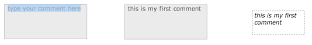

# Comments

> Comments are not involved in patch evaluations but can be helpful to document your programs !

Create comments in a patch using the shortcut <kbd>C</kbd> (or the general shortcut <kbd>N</kbd>, then typing "comment"). Then type a text in the editable box. 

 

You can resize, move, copy, delete them and edit comment's appearance and attributes as any other boxes (see [Inspect/edit box attributes](inspector)). 
