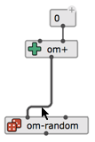
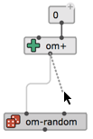
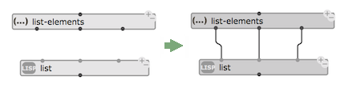
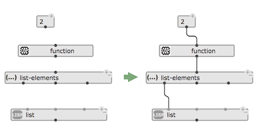
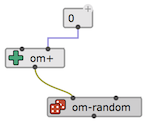
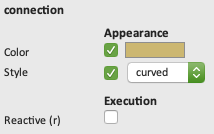

# Connections

> The main procedure to set the value of a function or object box input is to connect it to another box's output.
This is how functions are composed, and visual programs are built in OM.

In order to create a connection, use the mouse to drag from a box output to another box input.
If the connection is allowed (for instance, cycles are not permitted and inconsistent with the visual language semantics), the connection line will appear in the patch.

 

 
Existing connections can be selected with the mouse, re-routed (e.g. for readability) with "mouse drag", re-connected somewhere else, or deleted (using the <kbd>backspace</kbd> key).

> **Note**: Use the <kbd>I</kbd> key to rest the shape of a connection back to normal.

**Clicking** on a connected input allows to unconnect it, keep the connection at hand and re-connect it somewhere else.

 

<kbd>shift</kbd> + clicking on a connected input removes its connection (remember that <kbd>shift</kbd> + clicking again on an unconnected input [pops out its value as a box](box-inputs) and reconnects it).

------
## Commands for Automatic Connections

Two commands allow to auto-connect a number of selected boxes together:

- <kbd>C</kbd> follows left-to-right order in finding matches to the inputs of the bottom-most box: if several other boxes are selected, by trying to connect the different box to the successive outputs, or if only one other box is selected, by matching its outputs to the bottom box inputs.

 

- <kbd>shift</kbd> + <kbd>C</kbd> follows a bottom-to-top approach trying to cascade all selected boxes from first outputs to first inputs.

 

------
## Graphic Properties

The [inspector](inspector) interface [ <kbd>Ctrl/⌘</kbd>+<kbd>I</kbd> ] allows to set the color and shape of selected connection(s). 

 
 