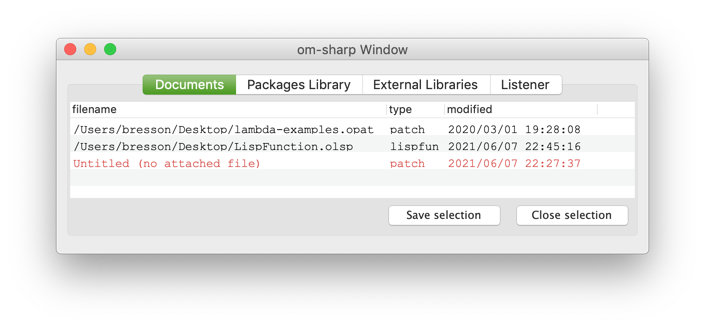
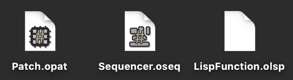
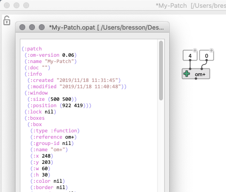

# Document management

The main documents handled in OM# are **[patches](patch)** (visual programs). Other documents include [sequencers](sequencer), and [Lisp-functions](lisp).

Documents are essentially managed as in standard desktop applications, as files that you can freely store and organise on the computer hard drive(s).
An internal document manager handles a list of open documents and their mutual dependencies.

> **Important note:** OM(#) differenciates **persistent** and **non-persistent** patches and documents. "Persistent" documents are saved on the disk, while "non-persistent" documents are just sub-documents (sub-patches, etc.) embedded in other documents. This difference has a number of impacts in the design of visual programs (see [Abstractions](abstraction)), and in the "File" commands described below.

The [Session window](session) includes a "Documents" tab displaying the list of documents currently open, displaying their pathname (if any), last modification date, etc. 

Documents displayed in red have no pathname (either don't have one, or point to a non-exiting file), and need to be saved/re-saved.

=> **Double-clicking on an item opens the document, or brings its window to the front.**

> Note that only _open_ documents are listed. When a document window is closed (and if it is not used inside another document) it is removed from the list. 
Closed documents may remain in the list if they are still used somewhere, inside other documents (see [Abstraction](abstraction)). 

-------
## File extensions

The main file extensions used in OM# are:

- **.opat**: [Patches](patch) (visual programs) 
- **.oseq**: [Sequencers](sequencer) (sequenced arrangements/programs)
- **.olsp**: [Lisp-functions](lisp) (in the OM# format)

------
## Open/Save/Duplicate/Reload documents

The "File" menu contains the main standard commands and short-cuts for opening, closing, saving documents.

- "New" proposes sub-menus for opening new documents ( <kbd>Ctrl/⌘</kbd>+<kbd>N</kbd> for a new patch)

- "Open" / <kbd>Ctrl/⌘</kbd>+<kbd>O</kbd> allows you to choose a file to open
- "Open Recent..." is a short-hand to the most-recently opened documents
- "Open Folder..." / <kbd>Ctrl/⌘</kbd>+<kbd>shift</kbd>+<kbd>O</kbd> allows you to choose a directory and open all the files that are inside this directory.

> **Note:** Depending on your installation and platform, you can generally just double-click a valid (.opat/.omaq/.olsp) file in your OS file system to open  it in OM#.

- "Save" / <kbd>Ctrl/⌘</kbd>+<kbd>S</kbd> saves the current document.

> **Note:** If the current editor is not of a **persistent** document (i.e. if it is an _internal_ patch/function/sequencer), then the "Save" command applies to its container document.

- "Save as..." / <kbd>Ctrl/⌘</kbd>+<kbd>shift</kbd>+<kbd>S</kbd> saves the current document as a new file (makes a duplicate).

> **Note:** If the current editor is not of a **persistent** document (i.e. if it is an _internal_ patch/function/sequencer), then the "Save as..." command will save this internal patch as a new persistent document.

- "Revert (Last Saved)" reloads the document from disk. This is useful when the document has been edited outside the environment (for instance, as text — see below), or to discard a series of recent un-saved edits. 

- "Close" / <kbd>Ctrl/⌘</kbd>+<kbd>W</kbd> closes the current window.

------
## File format

OM# documents are stored in a textual format readable both by humans and by Lisp programs.

It is therefore possible to edit a document by hand (or even, to generate it by a script) before to load (or reload) it in OM#.

> See and edit the text-version of an OM# patch using the "File / Open as Text..." menu.

