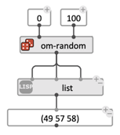
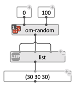
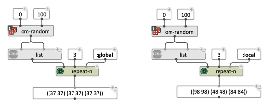
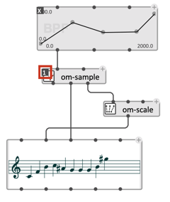
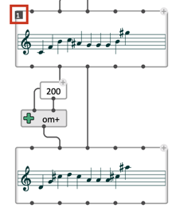
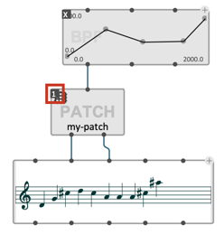

# Eval-Once Mode
 
The "eval-once" mode is a possible value of boxes' **[lock-state](eval-modes#lock-state)** attribute, which allows for the box to be reevaluated _only once_ per global request.

 A "global request" is either:
 * A user- or external [evaluation](eval) request in a top-level patch, or
 * A call to a sub-patch or [abstraction](abstraction) considered inside this patch.
 * An iteration inside a [loop](loop).

> #### IMPORTANT: Default Eval-Once
> **The *"Auto ev-once"* option in OM# [General Preferences](preferences) removes the possibility of user-personalised behaviors and *automatically sets every boxes to the "eval-once" mode behavior*.**     
>   
> 

### In "manual" mode (when *"Auto ev-once"* is off):

Use the key <kbd>1</kbd>, or the [inspector view](inspector) to set/unset the eval-once mode for selected boxes.

The **eval-once** mode changes the _number of times_ a box is evaluated if this box value is requested several times, that is, essentially:
 * if the box is connected to several other boxes through one or several of its ouputs
 * if the box is connected to a **REPEAT-N** box with **:local** scope (see below).

It has an impact on computational cost (and time!), by avoiding multiple, unnecessary executions of the same box.    
**It can also have an impact on the results, when the box or some of its upstream dependencies are not fully deterministic.**

> #### Examples
> In the first example below, the `om-random` box is evaluated 3 times in the "normal" case, and only 1 time if the eval/once mode is on.     
>     
>
> In the second examplem eval-once is set to another downstream box (`list`), making the call to `om-random` happen 3 times only, at the first evaluation of the `list` box.    
> 

### Eval-Once and the REPEAT-N box
 
**REPEAT-N** is a special box which simulates _N_ successive calls to a box.    
It's optional input `scope` affects the behavior of boxes that are connected to it, and in the **eval-once** state.
* If `scope` = `:local` each iteration end reinitializes the "eval-once context", and boxes are evaluated again at the first time of the next iteration.
* If `scope` = `:global` the "eval-once context" lasts during the whole patch execution (just like a normal function).

> See also the [help-patch](help) "repeat-n" in the OM# distribution. 

### Multiple outputs

The **eval-once** mode makes particular sense for any box with multiple outputs, when several of these outputs are evaluated.   
Below are typical examples where the eval-once mode _should_ generally be on (if not set by default in the preferences) in order to avoid multiple, unecessary computations and sometimes, inconsistent results:

1) 
2) 
3) 

In these different cases, the boxes in "eval-once" mode would otherwise be evaluated several times, which can be useless/costly, but also potentially wrong if different values result from of these different evaluations. 

> ***Hint: Keep the "Auto ev-once" option on in the OM# preference to avoid worrying about these different cases !***

