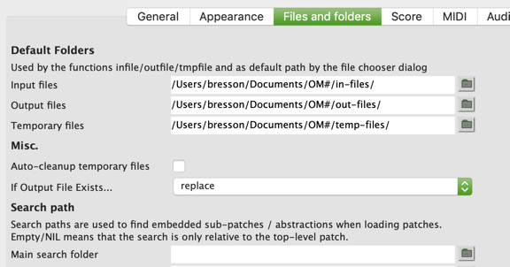
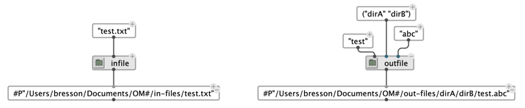
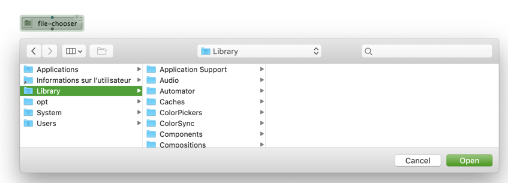
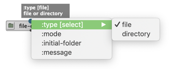
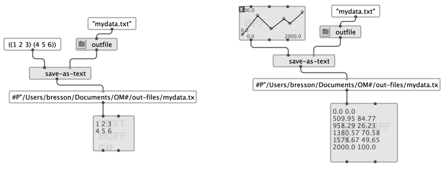
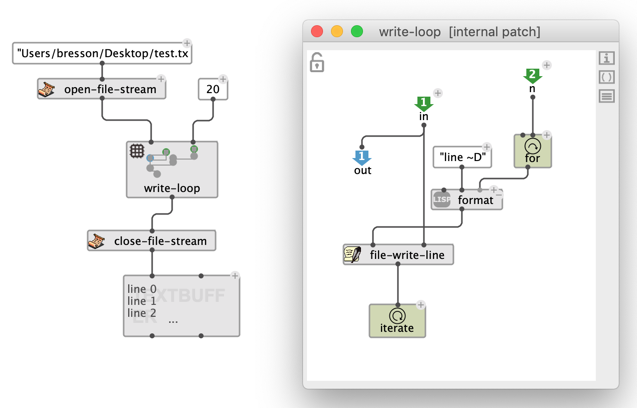

# Reading/Writing Files

> A <a href="https://www.cs.cmu.edu/Groups/AI/html/cltl/clm/node204.html#PATHNAME" target="_blank">pathname</a> is a Common Lisp type used to designate a file or directory in the file system.

Pathnames are commonly manipulated in Lisp programs (and in OM# visual programs) as soon as resources are to be read or stored in external files.

Common Lisp pathnames are printed with the prefix `#P`  (e.g. #P"/dirA/dirB/file.ext"), in order to differentiate them from strings ("/dirA/dirB/file.ext").

The basic common lisp functions and notions used for manipulating pathnames are:

- `make-pathname`: creates a pathname from a file name, extension, and a list of directories given respectively to the keyword arguments `:name`, `:type`, `:directory` (and more). E.g. `(make-pathname :directory '(:absolute "dira" "dirb") :name "file" :type "ext")`. See also `om-make-pathname` in the note below.
- `pathname-name`, `pathname-type`, `pathname-directory` allow accessing the respective parts (name, extension, list of directories) of the pathname.
- `pathname` converts a string in the equivalent pathname.
- `namestring` converts a pathname to the equivalent string.
- `merge-pathnames` facilitates creating pathnames by extending or modifying existing pathnames (see [a detailed description](http://www.lispworks.com/documentation/lw50/CLHS/Body/f_merge_.htm)). 
- `probe-file` tests if a file exists at this pathname.
- `directory` lists the files and directories contained in a given directory. See also `om-directory` in the note below.

> **Note:** OM# provides a number of additional facilities designed as higher-level functions on top of the Common Lisp pathnames. `om-make-pathname` and `om-directory` are for instance recommended for use in OM# patches, instead of  `make-pathname` and `directory`.

## Input and Output Files in OM#

OM# and external libraries include a number of functions reading or writing data to from/to external files (e.g `save-as-midi`, `save-as-text`, `import-midi`, `import-musicxml`, etc.).
These functions will generally include a (standard or [optional](box-inputs#optional)) input for specifying a pathname to read from, or to write to (generally, **:file**, **:in-file**, **:out-file**, **:path** or other similarly-named argument). These functions will expect a pathname argument (will generally support a simple string as well), and will generally fallback to a default pathname if no specific file is explicitly designated.

The "Files and Folders" preference tab in OM# [preferences](preferences) provides a number of options to parameterise the default folder locations and the behaviours of file reading/writing operations.

 

> #### Generating Pathnames to the Default Folders
> The functions `infile`, `outfile`, `tmpfile` all take a simple file name (and optionally type and list of directories) and generate a full pathname with it, using the location of the default input, output or temporary files defined in the "Files and Folders" preferences. 
>
>  

> #### File Chooser
> The `file-chooser` function launches a file chooser dialog window allowing to select a file or directory to read or create, depending on the options selected in its ["keyword" inputs](box-inputs#keyword). 
>
>  
>  

## Writing Data in Text Files

`save-as-text` is a simple utility to write different kind of data transiting in OM# programs, as a text file. Supported data types are lists, [BPF/BPC](bpf-bpc) (write the list of point coordinates), or [TextBuffer](textbuffer) objects (just write the contents to the file).

 

## Advanced Control over File Reading/Writing Operations

In order to perform more advanced file input/output operations, it is possible to open (and close!) file "streams" in OM# visual programs. A _file stream_ is a temporary accessor allowing to push or read data from a given location on the disk. A typical use case is the iterative processing or generation of data in a [loop](loop).

The  `open-file-stream` opens and returns a "stream" to a file (designated using a pathname), which can be used to incrementally read or write text data, using the functions `file-read-line` , `file-write-line` (or simply, `file-write`), all requiring the stream as one or their arguments. 
The stream should finally be closed using `close-file-stream`, so the file is freed and available for further operations. See also the `file-stream` help-patch.

 

> **Note:** A similar set of functions is available for manipulating (reading/writing) SDIF data using `open-sdif-stream`/ `close-sdif-stream`. See more in the [SDIF](sdif) section.
