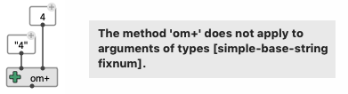

# Function Box

_Function Boxes_ are the main type of boxes in OM# visual programs. They _refer_ to Common Lisp functions.
Any function, in-built or defined in the environment, can be reified as a function box.

- Common Lisp functions appear without a specific icon with inputs corresponding to the function arguments, and an output corresponding to the returned value.

- OM#-specific functions are also Lisp functions, defined with special macros `defmethod*` / `defmethod!` (see [Writing code for OM#](write-code)). They present additional features such as icons, documentation, etc. 

In order to create an object box, select the corresponding _class_ from the "Boxes/Add Box" menu or in the "Packages" of the [Session window](session#the-packages-library-tab), or just type the class name in a new entry filed (double-click or type <kbd>N</kbd> on the main [patch editor view](patch).

### Inputs

The function ["lambda-lists"](http://www.lispworks.com/documentation/HyperSpec/Body/03_da.htm) determines the different inputs of a function boxes, and **the type of data that it accepted for each input**.

> In Common Lisp / OM# a data **type** can be either a basic type defined in the language (e.g. integer, string, symbol, ...) or determined by a class definition (e.g. BPF, CHORD, ...). Connecting wrong types to the function inputs yields an runtime-excecution error, that is generally handled and displayed by OM# as follows:      
>
> 

> See [Box Inputs](box-inputs) for details on the different kinds of inputs.

### Outputs

Most functions have one single output; some OM# functions can have more. 

Ordinarily the result of calling a Lisp function is a single Lisp object/value. Sometimes, however, it is convenient for a function to compute and return several objects. Common Lisp provides a mechanism for handling multiple values directly. For an OM box and in standard evaluation mode, the multiple outputs generally trigger several evaluations of the box.

> See [Evaluation modes](eval-modes) for advanced handling of multiple-evaluations of function boxes.

