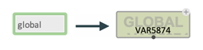
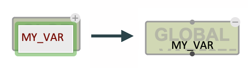
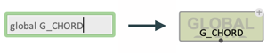
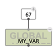
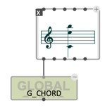
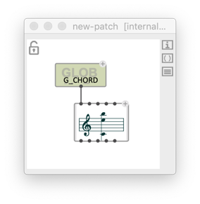

# Global variables

> Global variables are values shared in the whole OM# environment.    
> They can be used to create "side effects" : behaviours of the visual programs making them not strictly dependent on their inputs.    
> They can also facilitate communication and variable sharing between abstractions.    

Create a global variable by typing **`global`** in the new box entry field:

 

This valriable can then be renamed by editing the name field of the box:

 

It can also be name directly at creating the box:

 

The value is set using the optional inpt of the box:

 
 

Any copy of this variable box, or newly created global variable with the same name (and anywhere in the environment), will hold a pointer and allow direct access to the value:

 

