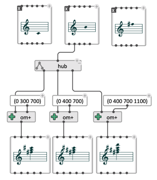

# Multiple connections: `hub`

The `hub` box is a patching facility which simply returns the same input value to a given number of ouputs. 
It is useful as a hub to limit disconnecting/reconnecting oprations. 

Add/remove ouputs using the `+`/ `-` buttons.

 

> **See also:** [`switch`](switch)
