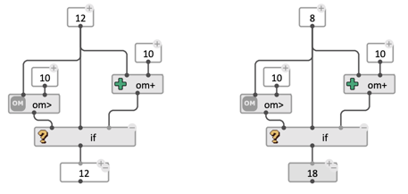

# Conditional: `if`

> `if` is a _conditional_ operator, which allows evaluating specific parts of a visual program based on the result of a given test.

The basic syntax (in Lisp) is: `(if TEST THEN ELSE)`    
...where **TEST**, **THEN** and **ELSE** are all expressions returning any type of data.

The condition **TEST** is said true when it evaluates to anything that is not `NIL`. Depending on the value of **TEST**, either **THEN** (if **TEST** is non-`NIL`) or **ELSE** (id **TEST** evaluates to `NIL`) will be evaluated. The result of the chosen expression is returned as the result of the `if` box.

**ELSE** is an [optional input](box-inputs#optional), and by default, the result of `if` on a false condition (if **TEST** evaluates to `NIL`) is also `NIL`. 

> **Note:** Contrary to most OM# boxes, and Lisp functions, `if` first evaluates its first input (TEST) in order to determine which one of THEN or ELSE to evaluate next. Therefore, **only one of THEN or ELSE input is evaluated**.

> **See also:** [Logical Operators](logic) 

