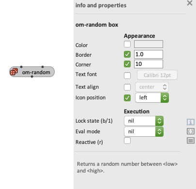
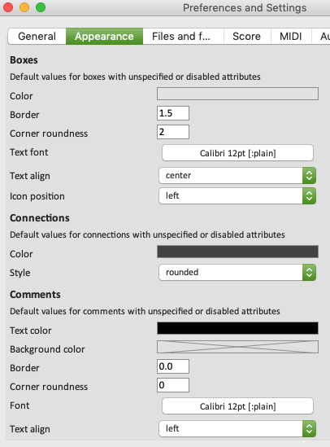

# Inspector view \| Inspect/edit box attributes

> The inspector view can be open at any time inside a patch editor window, using the menu "Edit/Show Inspector", the corresponding shortcut <kbd>Ctrl/⌘</kbd>+<kbd>I</kbd>, or the  button at the right of the editor window.

The inspector lists a number of attributes corresponding to selected object(s), followed by a short documentation text when available.

 

> The properties of selected patch [connections](connections) and [comments](comments) can also be edited using the inspector view.

> In case of _multiple_ selection, the inspector will show and let you edit all the attributes that are common to the different items in the selection.

The inspector contains two main sections: **Appearance** and **Execution**.

------
## Appearance

The **Appearance** section includes all attributes referring to the display and representation of a box.

The attributes preceded by a check-box on the left, refer to attributes that are also available at a general level in the application [Preferences](preferences) (section **Appearance** – see below): when the box is unchecked, the corresponding attribute of the box takes the general value as specified in the global preferences. When the box is checked, the box takes its own value for the attribute.

 

------
## Execution

**Execution** is the second important section of the box attribute inspector. It refers to the behaviour of the box during program executions (see [Evaluation](eval)).

The main attributes in this section are described in [Evaluation modes](eval-modes) and [Reactive processes](reactive).

The _lock-state_ and _reactive_ attributes also respond to editor keyboard shorcuts <kbd>B</kbd> / <kbd>1</kbd> (for _lock-state_ "locked" or "eval-once") and <kbd>R</kbd> (for _reactive_).

------

> **Note:** Some boxes also have additional inspector sections, such as **Structure** (for musical objects), **Scheduling** (for patch-boxes), or **Abstraction** (also for patch-boxes). See the sections [Abstraction](abstraction), [Maquette](maquette), and other pages of this manual for more details on the corresponding attributes.

