# Lambda Functions

The **lambda** mode can be found amongs the different available [evaluation modes](eval-modes#eval-mode) for certain types of boxes (mostly, [function boxes](function-box) and [abstractions](abstraction)).

Use the <kbd>L</kbd> key to set the selected box(es) mode to ***lambda***.

The **&lambda;** icon appears on the bottom-left corner of the box.

The evaluation of a box in the ***lambda*** state returns the function defined by this box, without actually executing it. 

> The ***lambda*** mechanism in OM# is equivalent to the `lambda` operator producing _anonymous functions_ in Common Lisp, or to similar syntax existing in other languages. 
> It corresponds to a _functional_ way of thingking about programs, and often allows expressing complex procedures in more concise and elegant way.

**The function returned by a _lambda_ can be passed as argument to another function (then called _higher-order function_)**     
In practice, this feature is generqlly used in two main situations that are addressed below:
- Delay the application of the function and/or perform it in [iterative contexts](#iterations) (see for instance `mapcar`, `reduce`, etc.)
- Use the function as a [custom test](#predicates-test-functions-used-by-other-functions) to personalize and control the behaviour of another function (e.g. a filter, sorting algorithm, etc. -- see for instance `remove-if`, `sort`, etc.)

## Higher-order functions

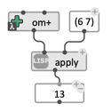

`apply` is one of the simplest example of higher-order function in Common Lisp. 
This function takes two arguments:
- a function
- a list of parameters.
It simply applies the function to the arguments.

> **It is very important that the function passed to `apply` (or to other higher-order functions) have the same number of arguments as the list or arguments provided.** Sometimes this requires some specific setting of the lambda-box in the OM# patch (see [below](#lambda-function-arguments)). In the previous example, the function `om+` has 2 arguments corresponding to the 2 values that are passed to `apply`. 

**Note:** Higher-order functions in Common Lisp (and in OM#) generally accept the symbol-name of a function as a short-hand for the function itself (when the function is not anonymous).
Since `om+` is defined as a function and has the right number of arguments, the previous patch could also be written as:

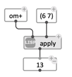
In this case, `om+` is not a [function box](function-box), but just the 'om+' symbol in a simple [value box](value-box).

## A first example: functions as variables parameters 

In the example below a list of four lambda-dunction is created, and the `nth-random` function chooses at random one of them to pass to `apply` in order to input the two numbers. 

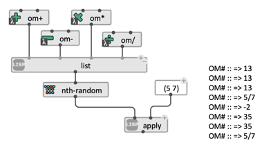

&rarr; This simple example illustrates how lambda-functions allow **_making functions the variables of a program_**.

## Predicates: test-functions used by other functions

It is common in functional languages that some functions use other functions passed as a parameter, to help performing different kinds of operations. This is often the case for test, predicates or comparison functions. 
Both Common Lisp and OM# feature this kind of functions, as show the examples below.

- The OM# function `sort-list` is capable of sorting a list of any kind of data: its arguments are (1) a list of data and (2) a comparison function used to perform the sort. Typically, for a list of numbers, the test will be the function `<` (which, indeed, is the default value). `(< a b)` returns `T` is a is lower than b: this is all `sort-list` needs to know in order to sort the list. It is therefore easy to (1) change the test to perform the sort differently (e.g. using `>` instead of `<` will sort the list in descending order), or (2) adapt the test to different types of data (e.g. using `string<` allows sorting a list of strings):

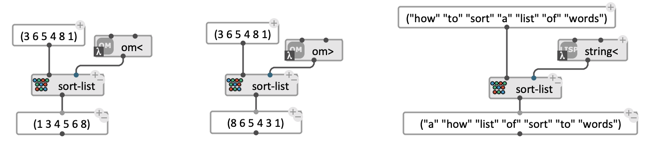

- The Common Lisp function `remove-if` returns a list cleared from all the elements complying with a given test. It is a generalization of the function `remove` : _remove x from list_ can be considered as _remove from list all elements such that element = x_. Another example is given below, removing all _odd_ elements from the list (using the predicate function `oddp`):

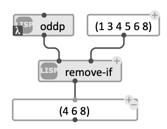

As we will see later on, such predicates or comparison functions can also be programmed (in Common Lisp or as OM# patches) to perform more specific tests.

## Key functions

List-processing functions such `sort-list` and `remove-if` often also have a functional argument called the "key", which allows to specify a means to extract the feature to be tested from each element of the list. 

Image `sort-list` now has to deal with a list of lists, such as `((1 3) (2 1) (6 0))` and needs to sort it considering ascending order of its second element. One solution is to define your own test function in Lisp or as an OM# patch, and pass it as a lambda-function to `sort-list`. Another, more elemgant one is to keep `<` as a test, but set the "key" to `second` so that the second element of each item in the list is used for testing:

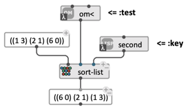

## Lambda-function arguments

> **The arguments of the function generated by a _lambda_ box correspon to its _free_ (or "unbound") inputs.** 
An input is considered free or unbound when it is not connected. 
>
> This simple rule allows to refine the definition of lambda functions, fixing a number of arguments programatically, and reducing the number of arguments (a process related to the notion of _partial application_ in computer science). 

Back to our a example, on could wish for isntance, that the function `remove-if` filters element that are _smaller than a given value_ (say, 3). No such inbuilt function exists, but it is easy to create one (see [next section](lambda-patches)), or to derive it by bixing the arguments of an existing one. 
We can indeed create the test "is lower than 3" by using the function `<` (_x_ lower than _y_) and fixing one of its arguments (_y_). In other words, we turn `(lambda (x y) (< x y))` into `(lambda (x) (< x 3))` by fixing the value of `y`:

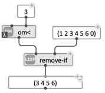

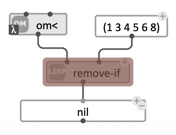

> **The number and order of the arguments/inputs of a lambda function is very important.** Common Lisp and OM# perform no compile-time checks on it, and most often, wrong matching appear at run-time. 
A typical error is triggered when a lambda-function is being passed the wrong number of arguments. The message  will be of the type:
> `Error at evaluating the box remove-if: #<anonymous interpreted function xxxxxx> got 1 arg, wanted at least 2 !`

## Iterations

> **Iterative processes and the `MAPCAR` function are one of the more widespread use of lambda functions in OM# (and in Common Lisp in general). I can be considered an alternative, generally more concise and elegant, to the [loop](loop) feature of the language.**

`MAPCAR` is a function that _maps_ another function to every successive element of a list, and collects the result:

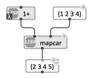
_Mapping `+1` to a list._  

`mapcar` must take as many arguments are there are lists provided (you can add a variable number of ardditional lists using the box's optional inputs). If more than one list is provided, an element of each list is used at each iteration, and the iteration stops as soon as one of the list is exhausted:

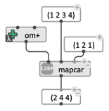
_Mapping `om+` to two lists: 1+1, 2+2, 3+1 (4 is ignored since the other list is exhausted)._  

**It is therefore important to well design and set the inputs of the lambda box that is used with `mapcar`, so that the adequate argument(s) is bound to the successive elements of the list(s):**

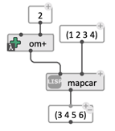
_Applying `om+` to a list, with one fixed parameter: adding a fixed amount._  

Another interesting similar Common Lisp function is `reduce`. `reduce` takes (1) a function of two arguments of the same type, which also returns an value of this type (for instance, a function of two numbers, which returns a number, like `om+`), and (2) a list of elements, also of this same type, and processes the list buy applying the function successively to each element of the list with the result of the previous iteration. As opposed to `mapcar`, which collects and returns a list of results, `reduce`reduces the list down to one single value:

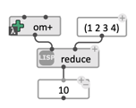
_(reduce 'om+ '(1 2 3 4)) => (+ (+ (+ 1 2) 3) 4) => 10_

## Lambda-Patches

Abstraction boxes ([patches](abstraction) or [Lisp-functions](lisp-function)) can also be set to _lambda_ mode. 
The same rules apply concerning the input/arguments binding and the applications of lambda-ified abstractions, which can be used as tests or functional parameters (see example below), or applied iteratively using `mapcar`and other similar functions.

In the following example we use a patch to redefine the notion of equality used in `remove-duplicates`, so that two number with octavle relationship be considered equal.

_Reminder: pitches in OM# are expressed in midicent, with one half-tone = 100. An octave is therefore equal to 1200, and pitches with octavle relationships are equal modulo 1200. For instance, 6000 and 7200 both correspond to a C, at different octaves, and indeed (6000-7200) % 1200 = 0._ 

Use of `remove-duplicates` with default equality-test:

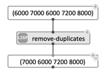

Custom test – returns T if the modulo by 1200 (or rest of euclidian division by 1200) of the pitch difference is 0:

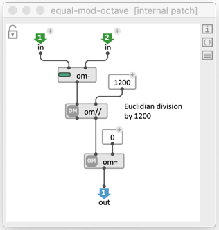

Use of `remove-duplicates` with new custom equality-test:

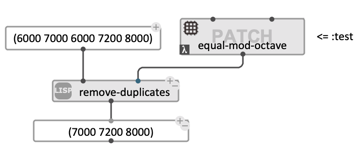

