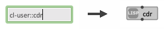
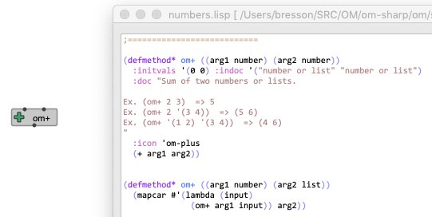
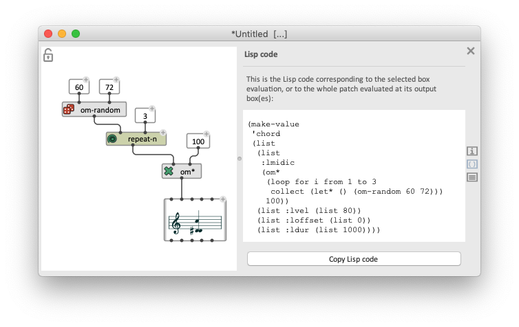

# Lisp Programming in OM#

_Sometime a few lines of code are more efficient and easier to write than a visual program !_
OM# includes a whole Lisp programming interface, and there exist several ways to edit and input/execute Lisp programs and commands in the environment.

> OM# is a Lisp environment, that is, it embeds the whole Common Lisp language and interpreter. Visual programs created in OM# are just compiled into Lisp functions before to execute, and can therefore seamlessly call and interact with pure Lisp program components.

>  
 Any function that is defined in Lisp can be instanciated as a "box" in OM# visual program. Just type its name (prefixed by its Lisp _package_ name if not in the **:om** package).    

> See [how to write functions and classes for OM#](write-code).

------
## Listener

The [Listener](listener) is the main entry point and connection between OM# and its underlying Lisp environment.

In the Listener you can [input](listener#input-lisp-commands-in-the-listener) simple commands (standard Lisp function calls) or load files (menu "Lisp/Load File...") that are edited in external Lisp/text editors.

------
## Lisp-buffers

In addition to OM#-specific document types (see [Document management](doc-management)) it is also possible to open Lisp files (from the menu "File/Open", extension: ".lisp") or new Lisp buffers to be saved as Lisp files (from the menu "File/New...").

> Note that Lisp files are not listed in the general OM# [document manager](doc-management), but Lisp-buffer windows are listed in the "Windows" menu.

In addition to standard text-editing commands, the OM# Lisp-buffer editor offers a few Lisp-specific commands and short-cuts accessible from the "Lisp" menu:

- "Eval Region" / <kbd>Ctrl/⌘</kbd>+<kbd>E</kbd> evaluates the selected region (should be a complete Lisp expression) or the Lisp form before the previous closing parenthesis. (Note: you can also use <kbd>ctrl</kbd>+<kbd>xe</kbd> for this).

- "Eval All" / <kbd>Ctrl/⌘</kbd>+<kbd>Y</kbd> evaluates the whole contents of the Lisp buffer, sequencially

- "Load File" loads the current file (if saved on disk) using the Lisp **load** command.

- "Find Definition" / <kbd>Ctrl/⌘</kbd>+<kbd>.</kbd> takes you to the definition of the symbol (function/variable/class name) currently under the text-edit cursor (if this definition can be found), opening a new Lisp-buffer window for it if necessary.

------
## Load your Lisp files

OM# can load Lisp files on startup, allowing you to quickly fix or extend the environment, or experiment with your own tools and functions.

Two main locations are possible:

- **The "Init" folder in the OM# application folder (or in the .app package on macOS):** 
The Lisp files in this folder are loaded before starting up the OM# session and environment. These should be essentially fixes to the compiled environment.

- **Your own folder, as defined in the General preferences:**     
The Lisp files in this folder are loaded at starting the session.

------
## Lisp in OM# patches

### "Find Definition" in Visual Programs

The equivalent of the previous "Find Definition" command is also available in viusal programs, from the menu "Help/Find source" or using the short-cut <kbd>Ctrl/⌘</kbd>+<kbd>shift</kbd>+<kbd>E</kbd> when a box is selected. 

This command will take you the Lisp source of the visual program component (if it can be found). You can eventuyally edit it, re-evaluate it from there, and modify its behaviour (be careful!). 

### Using "Lisp-functions"

**Lisp-functions** are specific kinds of OM# documents or internal abstractions, representing a single functions written as a Lisp "lambda expression".

> => See [Lisp Functions](lispfun-box).

### Getting the equivalent Lisp code of a patch

An interesting feature of the OM# patch editor is the possibility to display on a side panel, the equivalent Lisp code corresponding to part or all of a visual program.

> Open the "Lisp" pane in a patch editor with the button , from the menu "Edit/Show Lisp Code", or using the <kbd>Ctrl/⌘</kbd>+<kbd>L</kbd> shortcut.

The Lisp code corresponding to the evaluation of the selected box is displayed (if any) or otherwise, to the whole patch, as if it were compiled and [used as an abstraction in another patch](abstraction): _this patch must have at least one OUT box in order to do/return anything !_

> **Hint:** The generated Lisp translation can be copied (button "Copy Lisp Code") and reused in Lisp-buffers or Lisp-functions.

