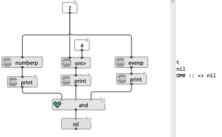
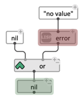

# Logical Operators: `and`/`or`

> `and` and `or` are _logical operators_ generally used to test wether _all_ or _any_ of a given number of conditions are met.    
They are typically used as tests for [contitional / `if`](if) statements.

The boxes can be added any number of [optional inputs](box-inputs#optional-inputs), which be evaluated left-to-right until a decision can be made:    

- `and` stops and returns NIL as soon as one of its inputs evaluates to NIL. Otherwise it returns the result of the last input evaluation.

  

- `or` returns the result of the first non-NIL encountered result, or NIL if there is no such result.

> **Contrary to most boxes in OM# (and functions in Lisp), _not all inputs are always evaluated_.**   
> **The order can change results significantly, and can used to control evaluation flow in visual programs.**

The following example tests if the input 1) is a number, 2) is greater than a given value, and 3) is even. Each evaluated branch prints its value. We are sure that if the input is not a number, the other tests will not even be made (they would lead to type errors).

 &nbsp;&nbsp;&nbsp;&nbsp; 

#### Flow control

The following example with `or` triggers an error if the first branch is NIL. Otherwise, the `error` branch is not evaluated.

 

#### Combining logical operators

Logical operators can be combined into more advanced logical expressions.    
The following example tests if the input is either s string or a number that is greater than a given value _and_ even:    

-----
> **See also:** [Conditional: `if`](if)

