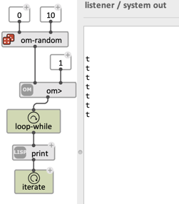

# Loops

> A _loop_ is an iteration: a process that repeats an operation a number of times to perform repetitive tasks, accumulation, collection of data, etc.
> Loops are not the easiest thing to do in OM#, but they can become a powerfull ally.    

> **See also:** [**`mapcar`**](lambda#iterations) is a nice an also powerful alternative to the OM# loop feature in many cases. It is often a matter of style! 

## `iterate`

Loops in OM# are standard patches (with any number of inputs and outputs) including one or more **`iterate`** boxes.    
**Each `iterate` box accounts for a loop.**

`iterate` evaluates its input(s) a number of time during that is determined by the loop _iterators_ (`loop-for`, `loop-list`, `loop-tail`, `loop-while`) that are conncted to it, either directly or indirectly. The example below prints the elements in a list:

The `iterate` box can have an arbitrary number of inputs, which are evaluated from left to right and allow for combining iterators and the sequencing of actions inside the loop.

`iterate` triggers evaluation, but does not return a value from the patch, as standard outputs / `out` boxes do.
The iterations therefore generally produce side-effects (`print` is one of them) or data collection (for instance using `collect` or `accum`, whose value can be returned by the patch outputs) (see below, [data collection](#data-collection)).    

While editing a loop, it is possible to get a "preview" of the iteration result by evaluating the `iterate` box.
The list displayed in the listener here is however a display artefact, as `iterate` by itself does not collect any data.

## Iterators: `loop-for`, `loop-list`, `loop-tail`, `loop-while`

There exist 4 different iterators:

- **`loop-list`** iterates on the successive elements of a list

- **`loop-tail`** iterates on the tail of a list, popping out the first element each time

- **`loop-for`** iterates between two numbers

- **`loop-while`** iterates while a given condition is true

    
> #### Optional inputs in iterators    
> Some iterators (`loop-for`, `loop-list`, `loop-tail`) have an optional input called `by` allowing to control the iteration with more advanced criteria. 
> 
> The meaning is somehow straightforward in the case of `loop-for`: _iterate from a to b **by** n_ (the default is 1).     
> 
> With `loop-list` and `loop-tail`, `by` is a function determining how to get the next state of the list (the default is `cdr`: we just pop the first element out).

### Combining iterators

Several iterators can be combined and connected to a same `iterate` box. 
This is when loops start to be more expressive and powerful than ususal `map...` iterators.    

The iteration stops as soon as one of the iterator finishes:

This makes sense in particular for the `loop-while` iterator, which essentially works connected to other iterators.

> **Note:** Iterator values are not valid outside of the `iterate` context. It is an error to connect it directly to a loop output, for instance.     
In order to return the last value of an iterator, use a [memory](memory) box like `mem` or `collect` (see below).

## Data collection

One of the main use of loops in OM# will be the iterative processing and collection of data. 
`collect` (or `accum`, for more advanced use) are `iterate`'s best friends for that purpose.

- Connect the first output (**:collect**) of a `collect` box to `iterate`, in order to collect/accumulate data in memory.
- Connect the second output (**:data-out**) of the `collect` box to an output to return the collected data at the end of the loop.

> **See also:** [Memory](memory) &rarr; More on `collect` / `accum`

## Summing Up...

When a patch containing an `iterate` box is evaluated, the following actions happen in order:

- Evlauation of the  `init-do` boxes (if any).     
_`init-do` is a special box specifying actions to perform before iteration starts (for instance preparing initial states)._
- Iteration of the `iterate` boxes
- Evaluation of the `out`boxes (just like in a standard patch)

> **Hint:** Up to a certain level of complexity, the [Lisp code visualization](lisp#getting-the-equivalent-lisp-code-of-a-patch) feature can be useful to understand what the loop-abstraction is doing.

