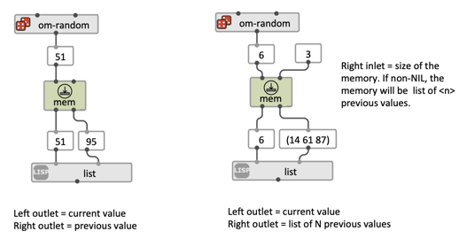
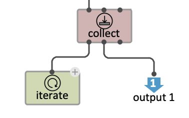
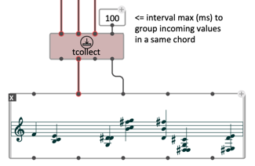
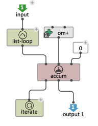

# Memory

OM# visual programs (and functional programs in general) usually don't deal much with memory. A function should produce no "side effects", and always behave identically / return the same result from a given set of parameters, regardless of what happens in the meantime, or of what results were computed previously.

This rule breaks very often in practice: for instance as soon as a program preforms a [file input or output](file-io). 
In addition, OM# provides various means to record and collect data in visual programs. 

The boxes described in this page all embed a storage slot, or **memory**.

> **Note:** [Global variables](global-variable) are another way of dealing with memory and side effects in OM#.

## A simple delay: `mem`

`mem` is a sort of delay that can be used in patches and [iterations](loop) to recall the previous value or the _n_ previous values that have passed through the box.

> **See the `mem` examples in OM# inbuilt Help Patches**

## Collectors: `collect`, `accum`, `tcollect`

`collect`, `accum`, and `tcollect` are advanced collectors inspired by OpenMusic's `omloop` feature.
They are meant to be used either inside OM# [loops](loop) or in [reactive programs](reactive), as a means to store and collect incoming data.    

> Remember that these boxes are simply holding the data in memory. 

### `collect`

`collect` is the main collector box, from which are derived the two others. 
Its memory is a simple list. 

`collect` has 3 inputs and 3 outputs, which behave slightly differently depending on whether they are evaluated in a standard way ("pulled" from the ouputs, typically, in a [loop](loop)) or activated by a [reactive notifier](reactive) ("pushed" on the inputs).

#### Standard case (pulling outputs)

* **:collect** evaluates the **:data-in** input, collects the value in the memory, returns the collected value.
* **:data-out** returns the current state of the memory as a list.
* **:init** (re)initializes the memory with the value of the **:init** input (default: NIL).

#### In reactive processes (pushing inputs)

Any `collect` input receiving a reactive notification simulates the evaluation of teh corresponding output:  

* **:data-in** collects the incoming value in the memory.
* **:push** triggers a notification on the **:data-out** output holding the current contents of the memory.
* **:init** triggers reinitialization with the memory with incoming value.

> **See [Reactive processes](reactive) and the _Core features/collect_ Help Patch**

### `tcollect`

`tcollect` is similar to `collect` but includes a temporal dimension. 

- An additional **:delay** input allows setting a delay in millseconds during which all collected data will be included in a common sub-list.

- An additional **:time-list** output returns a list of times corresponding to the collect time of each item in the memory.

> `tcollect` allows for instance the grouping of chords when processing a stream of incoming notes.     
> **See also the _Core features/collect_ Help Patch.**

### `accum`

`accum` is a generalization of `collect` that allows to perform user-defined collection strategies.
The main difference with `collect`is the second input, which here must receive an accumulation function able to process a combination of the input (_data-in_) with the current content of the memory.

Possible functions are for instance `+`, in order to sum up the inputs (supposingly numbers), `max` to maximize the values, or any other function or patch processing one inpu value and the current state of the memory.  

> `accum` is mostly intended to be used in [loops](loop) as a way to extend or specifilze the behavior of `collect` when needed.    
> **See the _Core features/loop_ Help Patch.**

> **Note:** `accum` has no _push_ input and therefore is not suited to work in reactive processes as `collect`/`tcollect` do.

