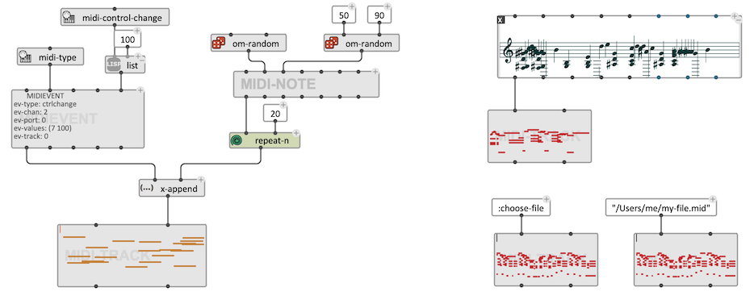
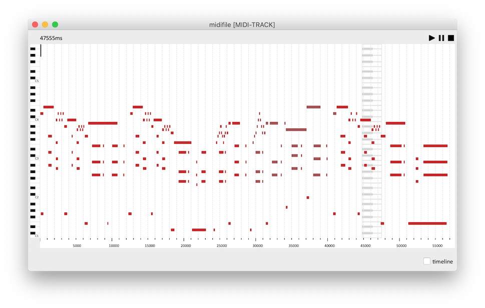

# MIDI-TRACK

The class MIDI-TRACK is a container for MIDI events. It contains a sequence of objects of type **MIDI-NOTE** or **MIDIEVENT**. 

## Initialization

**MIDI-TRACK** can be initailzed either by connecting a list of MIDIEVENTs / MIDI-NOTEs to its _midi-events_ input, or by connecting a compatible object on its _self_ input for automatic conversion.

A MIDI file can be loaded by just connecting a _pathname_ to _self_. If the value of _self_ is **:choose-file**, then the evaluation of the **MIDI-TRACK** box will open a file-chooser dialog for loading a MIDI file. 

 

## Editor

The editor of **MIDI-TRACK** displays and allows editing of the internal MIDI-NOTES as a "paino-roll" representation. 
Transpositions, time and duration edits, note addition or removal are allowed and performed with the usual commands, as well as playback, zoom-in and -out, and (timeline-editor) modifications.

 

## Compatibility

**MIDI-TRACK** corresponds, and extends the features of the **MIDIFILE** class in OM. At the difference of a MIDIFILE, the **MIDI-TRACK** is not attached to a file and actuall contains/internally stores the list of MIDI events.

Loading an OM patch containing a **MIDIFILE** will automatically convert it into a **MIDI-TRACK**, however, the _self_ input might need to be set to **:choose-file** and/or the file contents relaoded to obtain the exact same confirguration.

