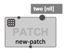
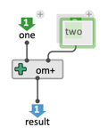
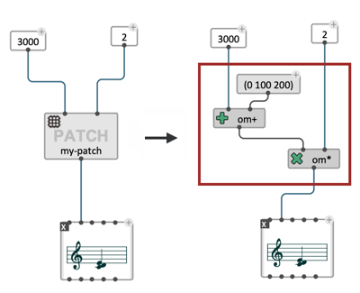

# Patch Box

> Patch boxes are the principal ways of manipulating [abstractions](abstraction) in OM#.

Patches can be created with the _File/New/_ menu or the <kbd>Ctrl/⌘</kbd> + <kbd>N</kbd> shortcut.    
They are saved as **.opat** files which can be used as _[global](abstraction#global-abstraction)_ abstractions.

_[Internal](abstraction#internal-abstraction)_ patch abstractions can be created from the _Box/Add Box..._ menu or typing **"patch"**, or **"p"** in the same text field you would use to type a function or class name (displayed with double-click or using the <kbd>N</kbd> keyboard shortcut).    

 

## Ins and Outs

> In functional programming languages, it is common to define abstraction as turning one or several terms of a function into variables.    
> For instance, let's consider the Lisp expression `(+ 5 1)`. If _5_ is turned into a variable _x_, then this expression becomes the function _f(x) = x + 1_ ; or in the Lisp syntax, the _lambda expression_ `(lambda (x) (+ x 1))`, which adds 1 to its input (or "argument").      
> When the functions called (or _applied_) in a given context, each variable (argument) is _bound_ to a value coming from this context.
>
> In OM#, abstraction are internally compiled into Lisp functions. **Turning a patch into an abstraction requires including in this patch _at least one "output" box_, determining the result or return value(s) of the abstraction, and a number (0 or more) "input" boxes, determining the inputs or arguments (or in other words, the _variables_ of the abstraction).**

In order to include an input or output in a patch, you can use one of the following options:

1. Type **"in"** or **"out"** in the same text field you would use to type a function or class name (displayed with double-click or using the <kbd>N</kbd> keyboard shortcut).    
    
    
2. Use the menus "Boxes/Add Box/Input" / "Boxes/Add Box/Output", then click somewhere in the container patch to create the new input or output box.

**&rarr; Connect the input and output boxes respectively to the parameters and resuts of the abstraction**

 

**In** / **Out** boxes correspond to the inlets / outlets of the abstraction boxes referring to the patch you are editing. 

 

 

### Renaming inputs and output

In and Out boxes can be renamed by double-clicking on the name label. 

> Giving consistent/meaningful names to the inputs and outputs is recommended for better readability and easier use of a patch inside container patches, but _the names have no influence on the patch execution_ (much like a variable name in standard text programming).

### Input default value

**Input** boxes have themselves [optional inlets](box-inputs#additional-inputs).
These inlets can be used to connect _default values_, which will be used for internal evaluations of the patch boxes. 

> The default values (that is, anything connected above **input** boxes) are not taken into account in the compilation of the patch, nor "outside" in the evaluation of the abstraction boxes referring to the patch.

> The [Lisp-equivalent "lambda" expression of the edited patch can be displayed](lisp#getting-the-equivalent-lisp-code-of-a-patch) on the patch side panel as long as at least one **ouput** box is present, and will be computed (just like during the patch compilation) from this or these output box(es). Input boxes are considered as the _arguments_ of the expression.     
 

## Encapsulation

**Encapsulation creates an internal abstraction from selected boxes in a patch.**     
Every connection excluded from the encapsulation becomes input or an output of the abstraction.    
To encapsulate selected boxes, use the corresponding "Boxes / Encapsulate selection" menu or the <kbd>shift</kbd> + <kbd>E</kbd> shortcut.

 

The inverse mechanism ("un-encapsulation") can be used to remove an abstraction and include its contents in the containing patch.     
To un-encapsulate an abstraction, use the "Boxes / Unencapsulate selection" menu or the <kbd>shift</kbd> + <kbd>U</kbd> shortcut.     
 

 

## Display 

Abstraction boxes offer three visualization modes, which can be switched from the _View_ item of the [inspector panel](inspector), or using the  <kbd>M</kbd> keyboard shortcut :

- **hidden**: no contents displayed besides the name of the astraction;
- ***mini-view***: displays a preview of the visual program graph;
- ***value***: displays the current value of the different outputs (as computed by the last evaluation of the box).
