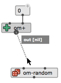

# Patch editor \| Basics of visual programming
 
> This page describes the main features and manipulations allowing to create, confirgurate and connect boxes in visual programs. See the other sections of this documentation for details on [evaluation/execution of the visual programs](eval), and other advanced visual programming features. 

Everything starts in the **patch editor**. Use the "File" menu to create a new patch, or open an existing patch, and display it in the patch editor window.

------

## Boxes

A box is a rectangular frame displaying a name (generally, the name of the function, object or embedded component it is referring to), an icon (sometimes) and a number of inlets and outlets.
**Inlets** (at the top) represent inputs of the function call. They corresponds to the _arguments_ of a [function box](function-box) or embedded [sub-patch](abstraction), or the _attributes_ of an [object constructor](objects).
**Outlets** represent the returned value(s).

**To create a box:**

- 
 Type <kbd>N</kbd> or double click anywhere on the patch editor background to create a function or object box. 
In the temporary text-input field, type a [simple value](value-box), or the name of the object you wish to add in the patch, then press <kbd>ENTER</kbd>.

- Use the **"Boxes/Add Box..." menu** of the patch editor window: just select a box name, then click somewhere in the patch editor.

- Use the _Packages Library_ tab of the main [Session window](session) [ <kbd>Ctrl/⌘</kbd>+<kbd>shift</kbd>+<kbd>W</kbd> ], to also double-click in a function or class icon, and then add it somewhere in the patch editor. 

> **Any Lisp function can be used** in a patch editor. 
However, only a subset of specific/documented functions declared in OM packages are visible in the function library and in the auto-completion lists.  

####	Auto-completion

- After typing the first letters of the object name, use the <kbd>↓</kbd> (down-arrow) key to activate **auto-completion** with all registered object names. Use <kbd>↓</kbd> and <kbd>↑</kbd> to navigate in the list, <kbd>ENTER</kbd> to validate your choice or <kbd>Esc</kbd> to exit.

> ### Documentation: 
> Use the menu "Help/Help Function & Class Reference" or the the <kbd>Ctrl/⌘</kbd>+<kbd>D</kbd> shortcut to open an auto-generated HTML reference documentation page of a box.

The boxes have a number of "active" areas, changing their appearance or the mouse cursor when dragged over:

- Resize areas at the right and bottom borders (when the box is resizable)

 
- Inputs and outputs (displaying tooltips: name, value and short documentation) 

- Add/remove input buttons (when available) — see below.

>  
Box **inputs** allow to enter arguments/attribute/parameters to OM# boxes. 
Their value can be set "by hand" by just clicking on the input and typing a simple value, or through connections to other boxes (see below).
>
>  
> Boxes with a small <kbd>+</kbd> icon at the upper-right corner have hidden [optional or keyword inputs](box-inputs). When such inputs are visible, they can be removed with the other small <kbd>-</kbd> button.
>
> => See [this page dedicated to box inputs](box-inputs).

------

## Connections

In order to create a connection, use the mouse to drag from a box output to another box input.
If the connection is allowed (for instance, cycles are not permitted and inconsistent with the visual language semantics), the connection line will appear in the patch.

 

Existing connections can be selected with the mouse, re-routed (e.g. for readability) with "mouse drag", re-connected somewhere else, or deleted (using the <kbd>backspace</kbd> key).

> => See the [dedicated page about Connections](connections). 

------

## Edits

> ### Lock 
> The icons   at the top of the patch window, or the menu "Edit/Edit lock" [ <kbd>Ctrl/⌘</kbd> + <kbd>E</kbd> ] allow you **lock/unlock** the patch editor.
In the lock mode:
- The patch can not be edited (most commands described in this page are disabled)
- Boxes can be [evaluated](eval)
- The [interface box](interface-boxes) and [value boxes](value-box) are reactive to simple mouse-clicks.

> ### Undo/Redo
>
> Use the standard <kbd>Ctrl/⌘</kbd>+<kbd>Z</kbd> / <kbd>Ctrl/⌘</kbd>+<kbd>shift</kbd>+<kbd>Z</kbd> in order to undo/redo your last editing operations.

### Move

Boxes can be dragged on the patch editor, and/or from one editor window to another.

Alternatively, the arrow keys <kbd>←</kbd> <kbd>→</kbd> <kbd>↑</kbd> <kbd>↓</kbd> also move selected boxes.     
<kbd>shift</kbd> + <kbd>←</kbd> <kbd>→</kbd> <kbd>↑</kbd> <kbd>↓</kbd> performs faster moves.

### Delete

Deleted selected boxes using the <kbd>backspace</kbd> key.

### Copy-Cut-Paste

- The "Edit" menu provides the standard Copy / Cut / Paste commands.

- Boxes can also be copied and pasted using the standard OS-specific drag&drop combinations: <kbd>alt</kbd> + _drag&drop_ on macOS, <kbd>ctrl</kbd> + _drag&drop_ on Windows/Linux.

All these operations can be perfomed on the same editor window, or from one editor window to another.

### Select All

The "Edit/Select all..." menu command / <kbd>Ctrl/⌘</kbd>+<kbd>A</kbd> selects everything in the patch window.

### Align

- The "Edit/Align Boxes" menu command, or <kbd>shift</kbd>+<kbd>A</kbd> key-combination,  automatically adjust the box layout to align positions of neighbour boxes and inputs vs. outputs. 

### Initialize

- The <kbd>I</kbd> keyboard shortcut reinitializes the box state (mostly, its size) to the default configuration.

- <kbd>shift</kbd> + <kbd>I</kbd> reinitializes the box value – this will be useful essentially for object boxes (see [Object boxes](objects)).

------

## Patch-editor side panel

> The patch editor has a _side panel_ on the right, which opens with the buttons    on the right-border of the window, or the corresponding commands and short-cuts in the "Edit" menu, in order to display:

- The [Listener output](listener)
- The [contents Inspector](inspector)
- The [patch-to-Lisp conversions](lisp)  

