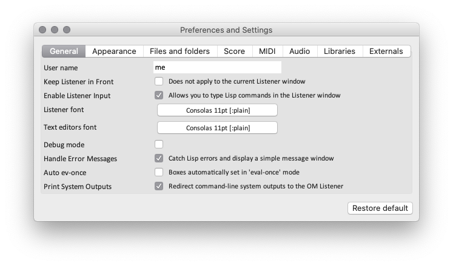

# Preferences

The "Preferences and Settings" windows allows you to set some global parameters of the environments.

It is available at any time from the "Windows" menu, or with the <kbd>Ctrl/⌘</kbd> + <kbd>,</kbd> shortcut.

Preferences are organised in "sections", which correspond to the different tabs of the window: General, Appearance, Libraries, Files and Folders, Score, MIDI, Audio, Libraries, Externals. The different sections and parameters will de detailed in relevant sections of this documentation.

> In general (and unless explicitely stated otherwise), modifications on a parameter applies immediately: no need to validate, or "Apply" your changes.

The button "Restore defaults" restore the current values for the current section/tab only.
