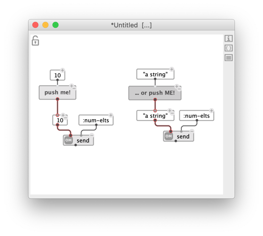

# Reactive processes

> The reactive mode enables interactive/real-time features in OM# visual programs. 

Reactivity can be set/unset: 

 
- At the level of a box input or output, using a contextual menu option ("set reactive"):

- At the level of a connection, using the "reactive" control of the inspector panel, or the <kbd>R</kbd> shortcut. Tbis is equivalent to setting/usetting the reactivity of the box input and of the box output at both sides of teh connection.

- At the level of a box, also using the "reactive" control of the inspector panel, or the <kbd>R</kbd> shortcut. This is equivalent to to setting/usetting the reactivity of all the inputs anf outputs of this box at once.

 

&rarr; Reactive inputs, outputs and connections are displayed with a slight red border.

> **A reactive box propagates a notification to downstream reactive boxes when its value changes.**      
> This can happen for the different reasons:
> - The box is [evaluated](eval);
> - Edition in the graphical editors (for [object boxes](object-box) or in the text field (for [value boxes](value-box));
> - Modification of an [input value](box-inputs);
> - Action of an [interface box](interface-boxes) (e.g. slider, etc.);
> - External notification or update (e.g. MIDI/OSC receive boxes – see below).
>
> **A notified reactive box that has no downstream reactive connections reevaluates itself automatically.**
> 
> This process makes for visual programs (or portions of visual programs) to _react to changes_ in the environment, either trigered by user actions for by incoming messages from other software.
>
> _&rarr; In the simple patch displayed above, this means that if the value of the box `5` changes for any reason, the value of the result box `61` will be updated with a new result._

> **Note:** Reactivity applies to the "first-level" visual program, that is, not inside the sub-patches. Even if it contains reactive boxes, a sub-patch is always considered as an "atomic" function in the reactive context.

## Examples and applications

#### Iteract with interface boxes

The [interface boxes](interface-boxes) provides plenty of opportunities top design interactive visual programs in OM#, which for the most part will make sense when used along with the reactive mode, in ordere to set an input value, change the routing of a patch, or trigger an actions.

   

#### Communicate internally: `send` / `receive`

The function `send` sets the value of any matching `receive` box present in the patches that are currently open in the OM# session. 

The message can be labelled in order to target a specific receiver, or a set of receivers, also initialized with that label.

Targetted `receive` boxes notify and update downstream reactive boxes.

   

#### Routing data

Data transferred througfh reactive program updates can be filtered and route by the `route` box.

`route` has unlimited [optional inputs](box-inputs#optional) which can be connected to different _tests_ (a function or patch box in [lambda mode](lambda), or just a function name tio apply, ). Received data will only be proagated if they comply with the test.

   

#### Communicate with the world

Data received from external applications through UDP/OSC or MIDI update and trigger computing in OM# visual programs.

The box `osc-receive` starts an UDP server thread when activated with <kbd>R</kbd>. This also turns it reactive, so that any incoming OSC message can be sent through a chain of reactive updates. Similar to `route`, the `osc-route` box can be used to parse OSC addresses and orient the received data in visual programs (see the [OSC](osc) section of this manual for more on OSC message processing). 

> **Note:** `osc-receive` needs to be turned off and on again if an error occurs during the propagation of an incoming event.

