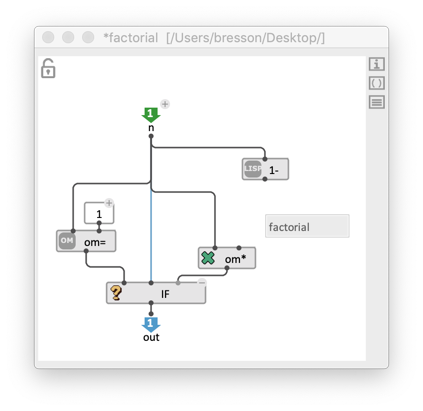
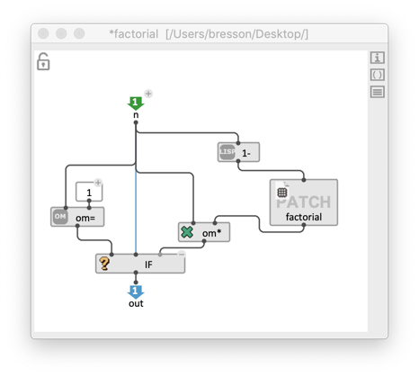

# Recursion

Recursion consists in calling a function in the body of this same function. It provides a powerful and elegant way to solve certain kinds of problems.

> A typical example is the mathematical _factorial_ (also noted with _!_): _`5! = 5 x 4 x 3 x 2 x 1`_.   
> The function _factorial_ can be defined as:     
> _`factorial(n) - n x factorial(n-1)`_.     
> It is important however, that the recursion have a _termination condition_. In the case of factorial, we need to complement the definition with:     
> _`factorial(0) = 1`_     
> In Common Lisp, _factorial_ can be implemented as follows:
> ```
> (defun factorial (n)     
>   (if (<= n 0) 1 (* n (factorial (- n 1)))))
```

**Note:** Recursion is also a useful and powerful means to handle recursive data structures like trees.


In OM#, recursive visual programs can be recursive as well, as long as they are set as **[global abstractions](abstraction#global-abstraction)**. Global (or "external") abstractions are stored on the disk and referenced in the document manager, and therefore can be used from anywhere (not only locally in the patch where they have been create — this is the case for "local", or [internal abstractions](abstraction#internal-abstraction)), including inside themselves.


> &rarr; Insert a global absttaction in itself as you would insert another global abstraction, that is, using one of the following options:
> - Using the menu "Boxes / Add box... / External abstraction", then selecting the current file on the disk.
> - Using the <kbd>p</kbd> shortcut and typing the name of the current patch
> - Dragging the current patch file icon from the Finder / file explorer.  
>
> See more on ["how to use global/external abtractions"](abstraction#global-abstraction).

 


