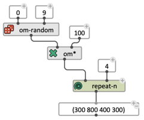
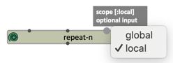
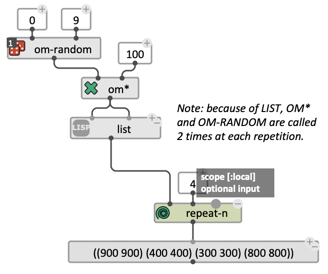
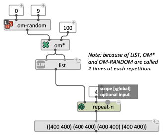

# Basic Iteration: `repeat-n`

`repeat-n` is a iterator utility which evaluates its first input a number of times (determined by its second input), and collects/returns the successive results as a list.

> **See also:** Advanced iterations: [loops](loop)

Contrary to a function like `create-list`, `repeat-n` actually repeats the evaluation of the input several times. As such, its collected results can vary and depend on program states. 

 

### Scope 

The [optional input](box-inputs#optional) `scope` affects the behavior of boxes that are connected to it, and in the [eval-once](eval-once) state.

 

- If `scope` = `:local` (default) each iteration of `repeat-n` reinitializes the "eval-once context", and boxes are evaluated again at the first time of the next iteration.
- If `scope` = `:global` the "eval-once context" is not modified by `repeat-n` iterations.

  

> **See also:** [Eval-Once Mode](eval-once) 
