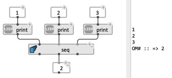
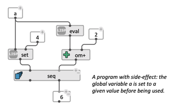
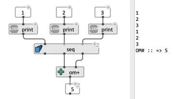

# Sequencing oprerations: `seq`

The `seq` box simply eveluates all its outputs in a specific order (from left to right) and returns results on corresponding ouputs.  

Add/remove inputs and ouputs using the `+`/ `-` buttons.

 

`seq is close to what a simple `list` call would do with similar inputs, but only returns the required data. By involving evaluation of expressions not necessarily bound to return data, this box supports the creation of programs with "side-effect", as in [_imperative_ programming](https://en.wikipedia.org/wiki/Imperative_programming) style.

 

 
> **Note:** If several ouputs are called, beware of multiple evaluation of the whole sequence, and consider using the [eval-once](eval-once) option. 

