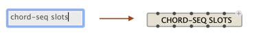
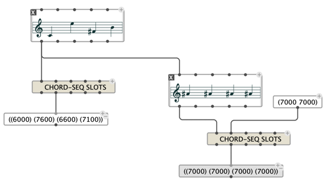
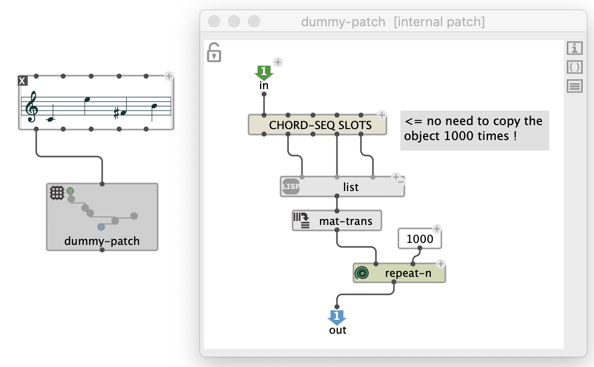
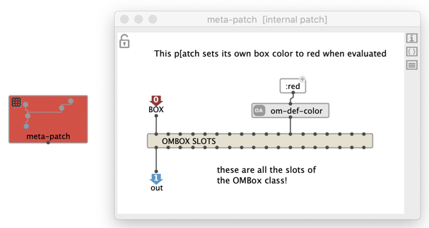

# Slots accessors

Functional programming tends to avoid side-effects: functions shouldn't to modify the state of the program anywhere outside of their own scope.
For this reason in general, data and objects are copied when they are passed to functions that are likely to modify them.
Connecting a value to the `self` input of an [object box](objects), for instance, makes a copy of it, so that no editing of the copy can affect the original data.     
Sometimes copy are costlly (in space/memory and time). The "slot accessors" described here is meant to allow for a direct read/write access to the slots of an object, without making a copy of it. These are to use with care and considerations !

## Slot-access: `slots`

`slots` is a general box allowing to display all the read/write accessors on the object connected to its first input.     
To create a `slots` box for a given class object, type the class name followed by "slots":

 

 

> **Note:** setting the slots generates a side-effect, by modifying the object connected to the `slots` box input. This side effect is not taken into accound as a "regular" edit, and therefore, this modification might not be visible in the editor of the input object, until the view is manually refreshed. 

## The basic use-case of "reading slots"

A subpatch using the data from an input object doesn't necessarily need to make a copy of it:

 

Note that this is mostly an optimization.

## A use-case of "setting slot"

I can't really think of a simple example of slot writing which doesn't either result from awckward patch design, or can be done differently at lower cost, except... &rarr; _meta-programming_ features.

We call "meta-programing" the fact for a program to "deal with itself", or generate other programs.
In a visual program, this would be a patch, or a box dealing with its own contents.
This is notably useful when creating advanced processes with the OM _maquette_ (or [sequencer](sequencer)): boxes can for instance position themselves (in time) according to some incoming information.  

OM# provides a number of boxes for this purpose, which will be detailed in a [dedicated section of this manual](meta-programming), such as `mybox`: a direct access to the box in which the visual program is executed.
In this case, the contents of `mybox` can only be set with the slot accessors of the class `OMBox`.

 

