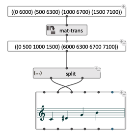

# Splitting list contents: `split`

`split` returns every element of an input list in a separate ouput. 
It is a useful shorthand to access the first few elements of a list. 

Add/remove ouputs using the `+`/ `-` buttons.

 

> **Note:** If several ouputs are called, beware of multiple re-evaluations of the list, and consider using the [eval-once](eval-once) option. 

> **See also:** [`hub`](hub)