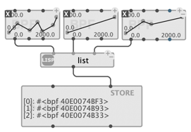
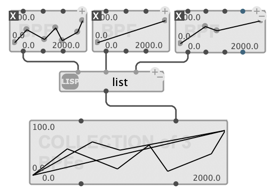
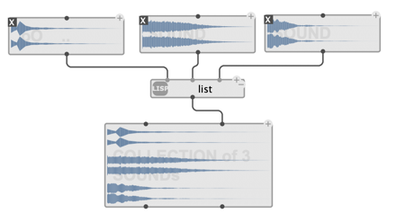
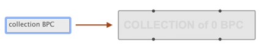
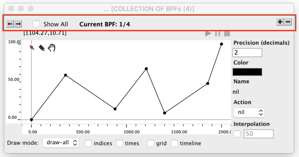
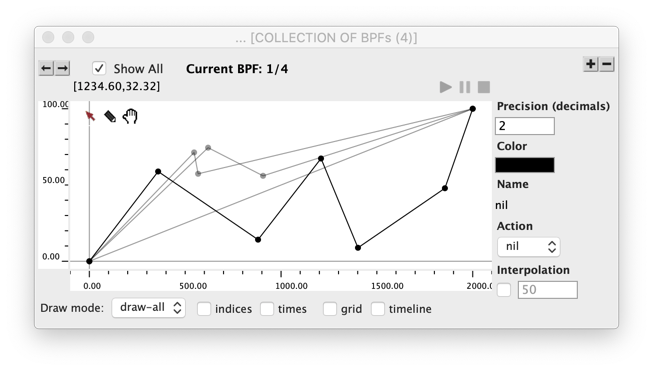

# Store and Collect

[Value boxes](value-box) are convienent for displaying and storing small and / or atomic data in visual programs.

Two other containers are proposed for larger list of values or objects

------
## `STORE`

Store is a simple container object, whose unique slot is `value`. 
Just use `value` to set or read the data.

 

> **Note:** [TEXTBUFFER](textbuffer) can be a useful substitute for `STORE` with certain type of textual or numeric data requiring editing

------
## `COLLECTION`

If the objects stored in a list are _standard-objects_ (that is, instances of _standard-classes_, as opposed to basic atomic Lisp values), and if they need to be edited graphically, the `COLLECTION` object might in turn come handy.

> **Important note:** `COLLECTION` only accepts a list of objects of the _same type_.

When available, `COLLECTION` will display the "miniview" of the collected objects, either superimposed on top of each other (e.g. for BPF, BPF, etc.) or, more generally, stacked as a column of displays (e.g. for `SOUND`, `MIDI-TRACK`, score objects, etc.)

 

`COLLECTION` automatically adopts the "type" of collected objects, so it is possible from the `COLLECTION` editor to add new objects of that type in the list. In order to create a new empty collection of a given type, just type `collection <type>` in the patch editor.

If the type of collected object has a graphical editor, `COLLECTION` will provide that same editor for display and editing its contents. The "regular" editor of the class is incremented with a bar at the top, containing the following controls:

- Display the current index and total number of stored objects.

- Switch to the previous / next elements of the collection (<kbd>&larr;</kbd> / <kbd>&rarr;</kbd> buttons) --- also available via <kbd>Ctrl/⌘</kbd> + <kbd>&larr;</kbd> / <kbd>&rarr;</kbd> on the keyboard.

- Add a new item of the same type to the collection (<kbd>+</kbd> button).

- Delete the current item (<kbd>-</kbd> button).

When available for the type of object, the "Show all" option enables simultaneous display of all the objects in the collection, while still editing the "Current" object at the front.     
   
 

> **Compatibility note:** `COLLECTION` corresponds to all the objects of type `_xxx_-LIB` from OpenMusic (e.g. `BPF-Lib`, `BPC-Lib`, etc.). In general the conversion is done automatically when importing OpenMusic patches to OM#.

