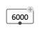
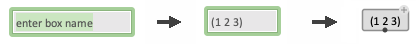
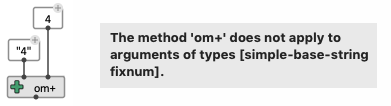
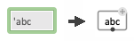
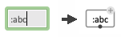
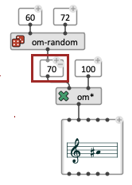
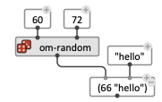
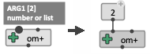
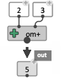

# Value Box

The "value box" is the simplest element in OM# visual programs.
It just contains / display a value, which can be of one of the following Common Lisp types:

- **Number** : 2, 4.0, 1.0d0, ...
- **Character** : #\\a, #\\b, ...
- **String** : "abc", "123", ...
- **Symbol** : bbd, om::abc, :key,  ...
- **List** : (1 2 3), (1 abc "abc"), ...

Type <kbd>N</kbd> or double click anywhere on the patch editor background to display a temporary text-input field ; then type/paste the value and press <kbd>ENTER</kbd>.

------

## About Types

> _Note that the type of the value can be crucial in the correct evaluation of your programs._    
For instance, "4" and 4 are very different kind of data (`"4"` is a _string_, 4 is a _number_) and 
 `(om+ "4" 1)` is not a correct expression to evaluate :     

_This section contains links top the online edition of [Common Lisp the Language, 2nd Edition](https://www.cs.cmu.edu/Groups/AI/html/cltl/m_cltl2.html), by Guy L. Steele._

### Types of Numbers

- Numbers without decimals are called _[integers](https://www.cs.cmu.edu/Groups/AI/html/cltl/clm/node17.html#SECTION00611000000000000000)_ (e.g. 1)
- Numbers with decimals are called _[floats](https://www.cs.cmu.edu/Groups/AI/html/cltl/clm/node19.html#SECTION00613000000000000000)_ (e.g. 1.0).    
- Specific notation allow to force the interpretation into more specific types (e.g. 1.0d0 for "double-floats").

### Characters and Strings

- `#\x` is the Common Lisp representation for the _[character](https://www.cs.cmu.edu/Groups/AI/html/cltl/clm/node21.html#SECTION00620000000000000000)_ 'x'
- A _[string](https://www.cs.cmu.edu/Groups/AI/html/cltl/clm/node31.html#SECTION00652000000000000000)_ is a sequence of characters between double-quotes: `"abc"`

### Symbols

A _[symbol](https://www.cs.cmu.edu/Groups/AI/html/cltl/clm/node27.html#SECTION00630000000000000000)_ is a specific data type used to bind variable and function with names. It is defined by a name, a value and interned in a package. The external representation of a symbol is a string without double-quotes (e.g. `abc`). 

In Common Lisp the evaluation of a symbol returns its value (e.g. if the value of the symbol `x` is 5, `x` _evaluates_ to `5`). In order to prevent this the language includes a _quote mechanism_ : `'x` evaluates to the symbol `x`, not to its value. 

**=> Use this quote mechanisme to enter a symbol as value in a value box.**

Common Lisp symbols are interened in [packages](https://www.cs.cmu.edu/Groups/AI/html/cltl/clm/node35.html#SECTION00680000000000000000) which must sometimes be explicitely stated along with the same. For convenience symbols used for their name (e.g. different options for the input of a function) are sometimes used with the special "keyword" package. In this case, the symbol is prefixed with a colon (e.g. `:abc`) and doesn't require a quote.

 

### Lists

> A [list](https://www.cs.cmu.edu/Groups/AI/html/cltl/clm/node28.html#SECTION00640000000000000000) is a sequence of any number of elements of any types, included between a pair of parentheses.

------

## Edit the Value

Double-cick the box to edit its contents. It is allowed to change the type of the value box contenst (for instance converting 4 into "4").

- When the value is a number, it is possible to increase/decrease this value using <kbd>Ctrl/⌘</kbd> + click/drag on the box (or <kbd>Ctrl/⌘</kbd> + <kbd>shift</kbd> + click/drag for a greater edit-step).

- When the patch is [locked](patch#lock) this procedure works without the <kbd>Ctrl/⌘</kbd> key.

------ 

## Connections 

The value box has one output which can be connected anywhere to supply value in a visual program.

It also has a free number of [additional/optional inputs](box-inputs), which allows the value to come from other part of this same visual program.
The value-box then becomes a convenient way to store and display intermediate results in a visual program:

> **Note:** If the value-box has several inputs, the interbnal value becomes a list collecting these values:     

------

## Popping-up value boxes

Value boxes are created automatically:

- By popping-up the current value of a box [input](box-inputs) with <kbd>shift</kbd> + click.     

- By popping-out the result of a box [evaluation](eval) with <kbd>Ctrl/⌘</kbd> + <kbd>shift</kbd> + click (when this result is of a simple data type).     

