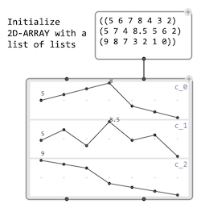
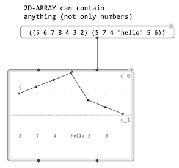
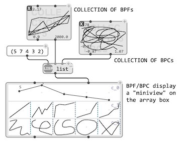
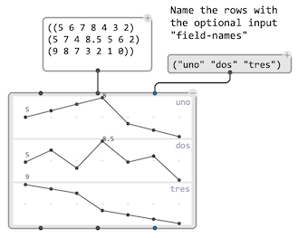
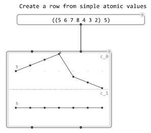

# `2D-ARRAY`

`2D-ARRAY` is a utility for the storage, visualization and processing of 2D data.
It is initialized with a list of lists of any kind of data.

The box [mini-view](objects#visualization) displays the contents of the array. If they contain numeric data, rows are displayed as break-point functions.

 

> [`BPF`](bpf) and [`BPC`](bpc) objects display a [mini-view](objects#visualization) inside each cell of the array.
>
> 

### Fields

The additional `:field-names` input allows specifying the name of each row, also displayed on the box mini-view.

### Size

Each row of the `2D-ARRAY` should be of the same length; however, the array can be constructed with shorter rows, which will not be resized and left empty in the box visualization. In this case the size of the array is determined by the size of the longest row.

> If a row is initialized with a simple value (not a list), a list will be created by repeating this value in order to fill every array columns.
>
> 

### Data access

`2D-ARRAY` data can be accessed by field using the `get-field` function (specifying either a field name or index).

The data can also be pulled out as a raw list of lists via the `:data` output of the `2D-ARRAY` box.
