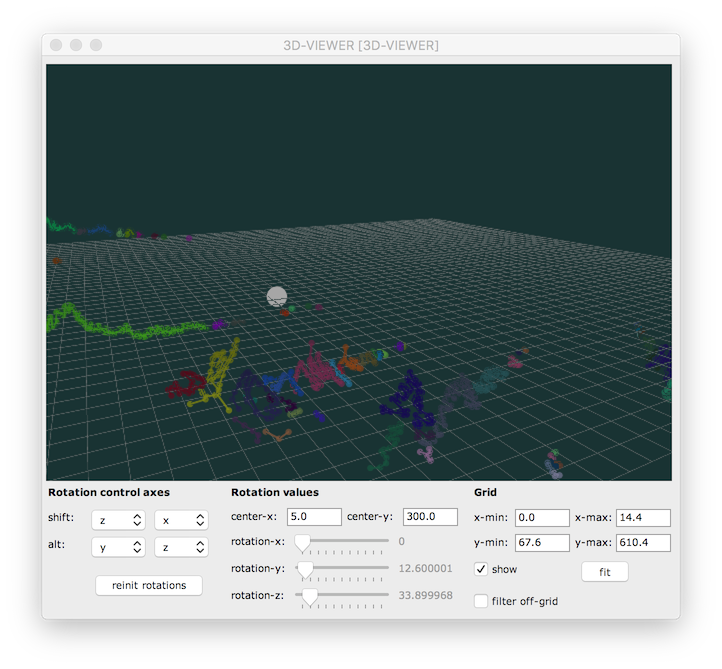

# `3D-MODEL`

`3D-MODEL` allows visualizing and editing 3D-objects.

> **Note:** For the simple visualization of 3D trajectories, the [`3DC`](3dc) object (eventually in a[`COLLECTION`](store-collect#collection) object) might be an easier choice.

## Construction 

Different types of 3D objects are supported: `3D-LINES`, `3D-CUBE` and `3D-SPHERE`.
These can be constructed as "standard" [objects](objects) in OM patches: 

- `3D-LINES` can also be specified as a simple list of values. In this case the color is assigned randomly. 

The main features the `3D-MODEL` editor are 3D-rotations along different combinations of axes.

## Viewpoint 

Modify the view point by using the mouse "click-and-drag".    
Viewpoint short-cuts:
- <kbd>+</kbd> : Zoom in
- <kbd>-</kbd> : Zoom out
- <kbd>Esc</kbd> : Reinitialize viewpoint
- <kbd>c</kbd> : Change background color

## Rotation

Rotate the data using the slider on the editor GUI, or use the mouse "click-and-drag" + <kbd>shift</kbd> or <kbd>alt</kbd> key pressed.
The editor GUI allows configuring the rotation axes according to the <kbd>shift</kbd> / <kbd>alt</kbd> keys.

Click-drag or double-click on the _center-x_ and _center-y_ frames to set the center of the rotation.

Rotation short-cuts:
- <kbd>&larr;</kbd> <kbd>&rarr;</kbd> <kbd>&uarr;</kbd> <kbd>&darr;</kbd> : move the center of rotation in the x/y plane
- <kbd>O</kbd> : Reinitialize rotations
- <kbd>shift</kbd> + <kbd>O</kbd> : Reinitialize rotation center

## Hints / How to use it

- Use additional inputs of the `3D-MODEL` box to set the rotation values, some scaling factor(s) and/or grid parameters from the OM patch.

- Use the function `get-transformed-data` to output the transformed data out of the viewer in an OM patch. 

- If _filter-off-grid_ is on, the data out of the grid will not be exported in `get-transformed-data`.

> **Note:** Press _Space_ in the editor to activate a [reactive notification](reactive) in the box. 
This will output transformed data out in the patch and update downstream reactive connected boxes.

