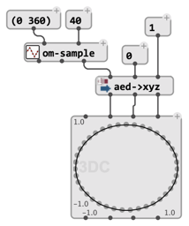
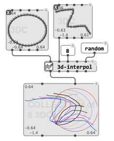
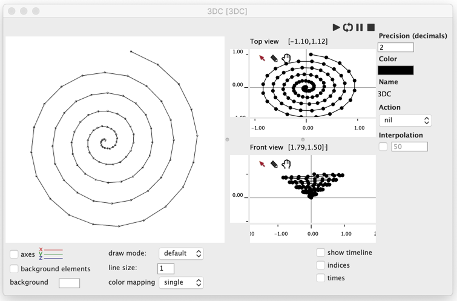
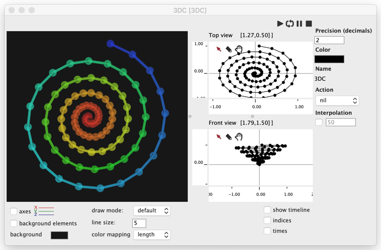
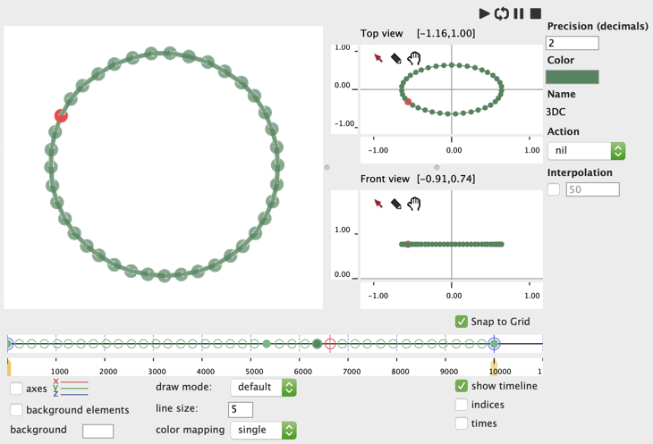
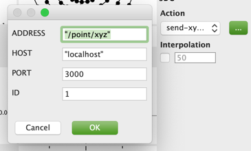
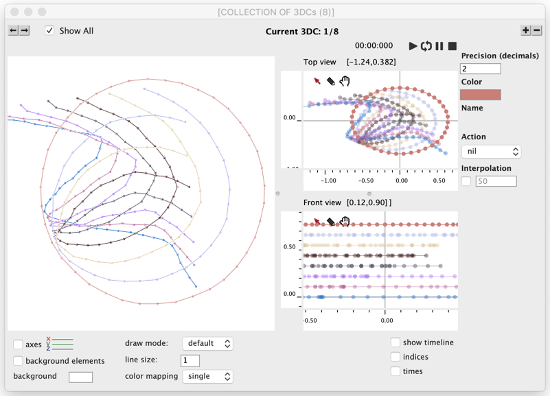

# `3DC` – 3D Curve

`3DC` is an extension of the [`BPC`](bpc) object in 3 dimensions.

It is initialized with lists of x, y, and z values describing the cartesian coordinates of a sequence of 3D-points points, as well as optional times for each points and a number of additional parameters.

Most tools available for processing 2D curves apply with 3DC objects as well. 
In addition, the "3D" package includes a few functions adapted to the processing of 3D data, such as `3d-interpol` or `3d-sample`.

> The "3D > Conversions" package extends the tools available in the "Basic Tools" package for 3D coordinates (see `aed->xyz` above). These are useful to program 3D-curves and construct 3DC objects.

## Editor

The `3DC` editor is split into a vizualization part (3D view on the left), and an editing part (2D views on the right).

### Visualization

Data can not be edited in the 3D view, however some elementary 3D navigation is possible:

- Click + Drag for **rotations**
- Click + <kbd>alt</kbd>/<kbd>option</kbd> + Drag for **translations**
- Click + <kbd>shift</kbd> + Drag Up/Down for **zoom in/out**

**Visulalization options** at the bottom of the editor window apply either to the 3D or 2D views, or sometimes to both.

- Show/Hide axes (3D view)
- Show/Hide ["background" elements](background-element) (3D view)
- Background color (3D view)
- Draw mode: points, lines or points + lines (default) (3D and 2D views)
- Line size (3D view)
- Color mapping (3D view) 
- Show/Hide point indices (2D views)
- Show/Hide point times (2D views)

### Editing

Editing is performed in 2D using two embedded [BPC editors](bpc#editor), corresponding to the top (x, y) and front (x, z) views of the 3D curve.

These editors can be zoomed/scrolled and edited individually. All data modification gets reflected on the other views.

As for [`BPF`](bpf)/[`BPC`](bpc) objects, the other attributes at the right of thes editors apply to the object: precision of the points (`decimals`), `color`, `name`, `action` (see below).

## Time and rendering of 3D trajectories

`3DC` is also a [time-sequence](time-sequence): each point can be assigned a time, in order to describe the temporal evolution of a trajectory. The [timeline view](time-sequence#timeline-editor) allows controlling and editing the temporal dimension of the trajectory.
As for other similar objects, the times can be made explicit, or deduced by interpolation between anchor points.

A `3DC` can also be played in order to perform an action at each point, or at each interpolated step of the trajectory.

An **action** can be set to execute at each point: either one of the predefined and parameterizable actions (`print`, `send-xyz-as-osc`, ...) or any other function name or [lambda patch](lambda) set to process the x, y, z values of a 3D-point.

> &rarr; See the similar description of [`BPF` actions](bpf#actions). 

## Collections

The `3DC` editor supports integration in the [`COLLECTION`](store-collect#collection) editor, where several `3DC` objects can be jointly visualized and edited. 

