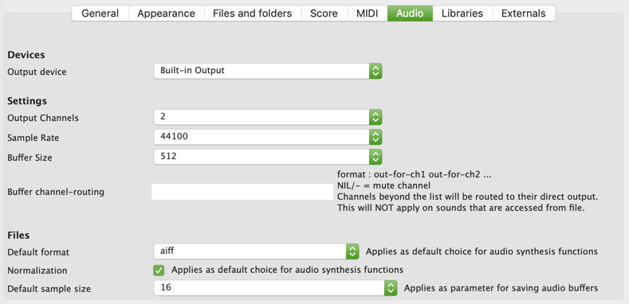

# Audio Settings

The "Audio" tab of the OM# preferences allows setting the audio output, as well as some parameters of audio file synthesis and writing.

 

# Audio Output

The **Devices** and **Settings** sections allow choosing a device of driver for the general audio output, and setting its parameters (number of channels, sample rate, buffer size).

> With the **"buffer channel routing"** field, a list of output channels can be provided to route the outputs of sound buffers to specific channels of the output device. For instance, `(5 - 1 2)` would route the channel 1 to the 5th channel of the device, mute channel 2 ("-"), and route channels 3 and 4 to the first and second channels of the device.    
&rarr; **Important note:** This applies only for those `SOUND` objects that are not [read from disk](sound#parameters).

# File writing options

For the functions of OM# or external libraries writing files on the disk the preferences of the **Files** section allow choosing a default file format and normalization preference. These parameters are generally overwritten if other values are supplied in the specific functions.

