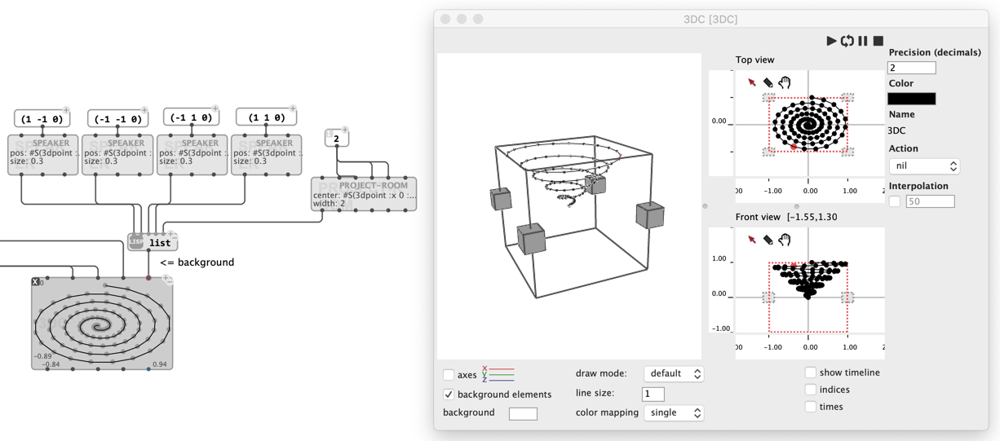

# Background Elements (for `BPF`/`BPC`/`3DC`)

"Background elements" are extra objects that can be added in the background of `BPF`/`BPC`/`3DC` editors in order to situate the data in a spatial context. They are typically useful for visualizing spatialization data.

Two types of backgroud element objects are currently available:

- `SPEAKER` (defined by a position and a size)
- `PROJECT-ROOM` (defined by a center and width/depth/height dimensions)

Background elements can be connected to the `:background` ["box attribute" input](objects#box-attribute-inputs) of the BPF, BPC or 3DC box.

