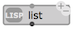

# Box inputs

Box inputs allow entering arguments/attribute/parameters to OM# boxes.

These values can be set "by hand" by just clicking on the input and typing a simple value, or through a [connection](patch#connections) to another box's output.

 

> **Note:** <kbd>shift</kbd> + click on the input will automatically create a [simple value box](value-box) connected to the input.
>
>  

## Additional Inputs

Boxes with a small <kbd>+</kbd> icon at the top-left corner have hidden **optional or keyword inputs**. When such inputs are visible, they can be removed with the other small <kbd>-</kbd> button.

  

There exist two types of additional inputs, which correspond to different existing types of arguments in Common Lisp:

### Optional

Optional inputs correspond to the keywords _&optional_ or _&rest_ in Common Lisp [lambda-lists](http://www.lispworks.com/documentation/HyperSpec/Body/03_da.htm). 
They represent an fix-ordered sequence of additional arguments. 
Added optional inputs can be inspected and used just as other inputs.

> **Note:** Alternative shortcuts for adding/removing optional inputs are <kbd>alt</kbd> + <kbd>→</kbd> and <kbd>alt</kbd> + <kbd>←</kbd> , or <kbd>></kbd> and <kbd><</kbd>.

### Keyword

Keyword inputs are additional inputs which must be 1) named and 2) set by the user beforehand.
They correspond to the keyword _&key_ in Common Lisp [lambda-lists](http://www.lispworks.com/documentation/HyperSpec/Body/03_da.htm). 

The list of available keywords is accessed by clicking the input. 
By default keywords are added in the order of the list, but they can be renamed and interchanged anytime.
As compared to optional inputs, this mechanisms prevents for instance from displaying all the additional inputs when only the last one is to be used.

 

Once the name of the keyword input is selected, it's value can be set either by [connecting a value](connections) to it or (in some cases where the number of possible value is small and finite) via a second embedded menu:

 

> **Note:** Alternative shortcuts for adding/removing keyword inputs are <kbd>K</kbd> and <kbd>shift</kbd> + <kbd>K</kbd>.
