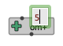

# Boxes

A **box** is a rectangular frame displaying a name (generally, the name of the function, object or embedded component it is referring to), an icon (sometimes) and a number of inlets and outlets.
**Inlets** (at the top) represent inputs of the function call. They corresponds to the _arguments_ of a [function box](function-box) or embedded [sub-patch](abstraction), or the _attributes_ of an [object constructor](objects).
**Outlets** represent the returned value(s).

----
### Create a box

- 
 Type <kbd>N</kbd> or double click anywhere on the patch editor background to create a function or object box. 
In the temporary text-input field, type a [simple value](value-box), or the name of the object you wish to add in the patch, then press <kbd>ENTER</kbd>.

- Use the **"Boxes/Add Box..." menu** of the patch editor window: just select a box name, then click somewhere in the patch editor.

- Use the _Packages Library_ tab of the main [Session window](session) [ <kbd>Ctrl/⌘</kbd>+<kbd>shift</kbd>+<kbd>W</kbd> ], to also double-click in a function or class icon, and then add it somewhere in the patch editor. 

#### Auto-completion

- After typing the first letters of the object name, use the <kbd>↓</kbd> (down-arrow) key to activate **auto-completion** with all registered object names. Use <kbd>↓</kbd> and <kbd>↑</kbd> to navigate in the list, <kbd>ENTER</kbd> to validate your choice or <kbd>Esc</kbd> to exit.

> **Any Lisp function can be used** in a patch editor. 
However, only a subset of specific/documented functions declared in OM packages are visible in the function library and in the auto-completion lists.  

----
### General 

The boxes have a number of "active" areas, changing their appearance or the mouse cursor when dragged over:

- Resize areas at the right and bottom borders (when the box is resizable)

 
- Inputs and outputs (displaying tooltips: name, value and short documentation) 

- Add/remove input buttons (when available) — see below.

>  
Box **inputs** allow to enter arguments/attribute/parameters to OM# boxes. 
Their value can be set "by hand" by just clicking on the input and typing a simple value, or through [connections](connections) to other boxes.
>
>  
> Boxes with a small <kbd>+</kbd> icon at the upper-right corner have hidden [optional or keyword inputs](box-inputs). When such inputs are visible, they can be removed with the other small <kbd>-</kbd> button.
>
> &rarr; See [this page dedicated to box inputs](box-inputs).

----
### Properties

Box properties can be modified from the [inspector view](inspector).

- The "Edit/Align Boxes" menu command, or <kbd>shift</kbd>+<kbd>A</kbd> key-combination,  automatically adjust the box layout to align positions of neighbour boxes and inputs vs. outputs. 

- The <kbd>I</kbd> keyboard shortcut reinitializes the box size.

----
### Value

A box has a value, that is updated at each [evaluation](eval) \| <kbd>V</kbd>.

The value can be reinitialized to its default state (when relevant) with the <kbd>shift</kbd> + <kbd>I</kbd> key.

----
### Documentation

Use the "[Help](help)" menu items "Function & Class Reference" \| <kbd>Ctrl/⌘</kbd>+<kbd>D</kbd> to open an auto-generated HTML reference documentation page, or "Print Documentation" \| <kbd>D</kbd> to print the basic documentation of a box in the [Listener](listener).

