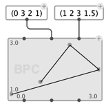
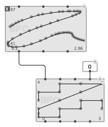
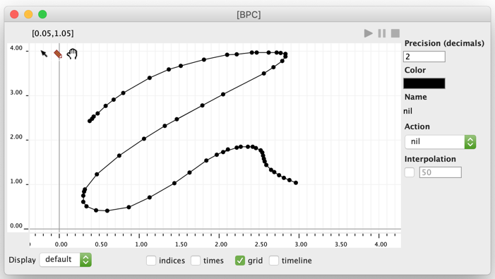
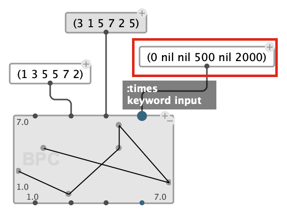
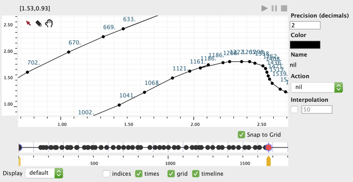
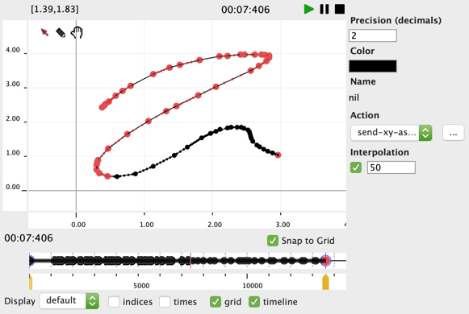

# `BPC` – Break-Point Curve

The `BPC` [object](objects) is a variant of the [`BPF`](bpf) where x-coordinates are not ordered. 
It allows drawing free curves (shapes, trajectories) as a succession of 2D-points.

## Construction 

### Points

The BPC points are specified with two separate lists of x and y coordinates (called respectively `x-points` and `y-points`).

The output values of these points can be either read via the corresponding `x-points` and `y-points` outputs, or using the `point-pairs`function.

### Precision

BPCs have a **precision** parameter, which can be set between 0 and 10 decimals. 
Input `x-points` and `y-points` are automatically truncated to this precision.

### Other attributes

The BPC box has additional [optional inputs](objects#additionaloptional-inputsoutputs) that are similar to those of the [`BPF`](bpf#other-bpf-attributes), such as **name**, **color**, **action**, etc.

### Box Attributes 

The `BPC` box has the same ["box attribute" inputs](objects#box-attribute-inputs) as the [`BPF`](bpf#box-attributes).

## Editor

The BPC editor extends the [BPF editor](bpf#editor) with 2D-drawing capabilities.

 

It has otherwise the same editing and visualization modes, options, and commands. See the [BPF editor section](bpf#editor).

## `time-sequence`

Contrary to a BPF, where x-coordinates are considered as the time dimension, the BPC objects includes **times** as an additional (optional) information attached to each individual point.

A list of `times` can be provided as an [optional input](objects#additionaloptional-inputsoutputs) of the `BPC` box, where time can be either a number (time in millisecond) or NIL.

> Reminder: untimed points (point whose time is NIL) will see their play time interpolated between neighbouring timed-points.

 

Times can be visualized and edited using the "times" visualization option and/or using the embedded [timeline](time-sequence#editor) editor.

 

## Play / Actions

> &rarr; Much like the BPF, the BPF object can be [played](bpf#play) and assigned [actions](bpf#actions) and [interpolation](bpf#interpolation) parameters.
>
>  

