# `BPF` – Break-Point Function

The `BPF` [object](objects) is a list of ordered [x, y] points which represent a "function", or relation of a given parameter to another parameter.

> **&rarr; The "Curves and Functions" and "Interpolation" sub-packages of the "Basic Tools" [package](session#the-packages-library-tab), also include numerous useful utilities to manipulate and process BPF data, such as `bpf-scale`, `bpf-interpol`, `bpf-crossfade`, `bpf-spline`, `x-transfer` / `y-transfer`, `om-sample`, and many more. See for instance the Functions/Classes Reference (menu "Help").**

## Construction 

### Points

The BPF points are specified with two separate lists of x and y coordinates (called respectively `x-points` and `y-points`).

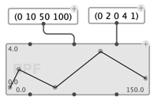

The output values of these points can be either read via the corresponding `x-points` and `y-points` outputs, or using the `point-pairs`function.

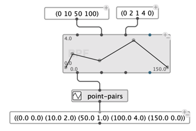

### Precision

BPFs have a **precision** parameter, which can be set between 0 and 10 decimals. 
Input `x-points` and `y-points` are automatically truncated to this precision.

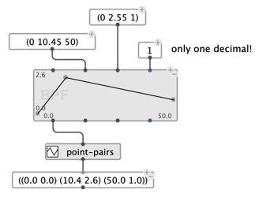

> **Note:** Precision is an important parameter to consider when converting data, e.g. from sound analysis to the symbolic level. A low precision value can be responsible for excessive rounding or truncating the values.     
>
> 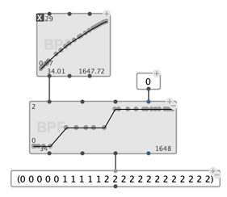

### Other BPF attributes

Other parameters can be set from [optional inputs](objects#additionaloptional-inputsoutputs) of the `BPF` box, such as the **name**, the **color**, or others mentioned below.

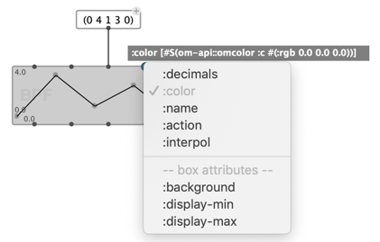 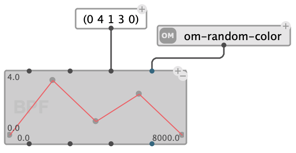

### Box Attributes 

Some additional display parameters can be set directly on the `BPF` box through [box attributes inputs](objects#box-attributes-inputs).
The `display-min` / `display-max` parameters change the vertical range that is displayed on the box.

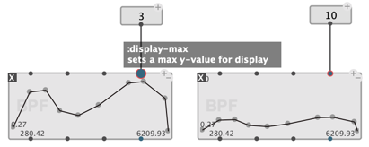 

## Editor

The BPF box editor is constituted by a BPF-editing view (on the left) and a general property editing panel (on the right).

General parameters on the right allow to manually set most parameters that could otherwise be set from the BPF box optional inputs (see [above](#other-attributes) — more will also be discussed below).

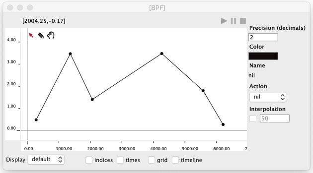 

### BPF Editing

The main view on the left displays the BPF, and offers zoom/scroll utilities through two (vertical and horizontal) rulers, and standard corresponding mouse interactions.  
The editor options at the bottom allow to show/hide a grid in the background, display point indices and other visualisation options described below.

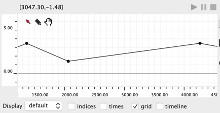 

### View Modes 

The "Display" chooser allows to switch between several visualizations of the BPF:

- **"Default"** (points connected by straight lines)    

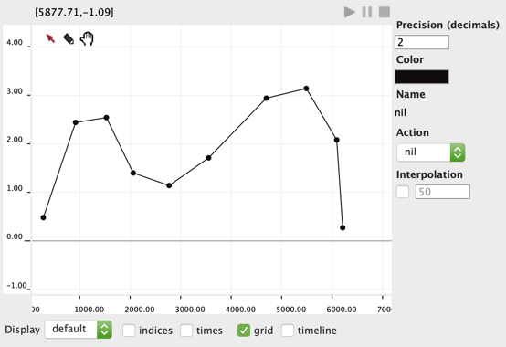 

- **Points only** 

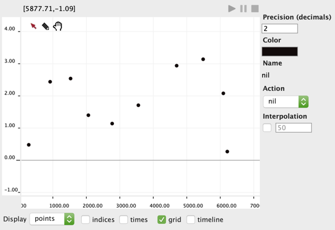 

- **Lines only**

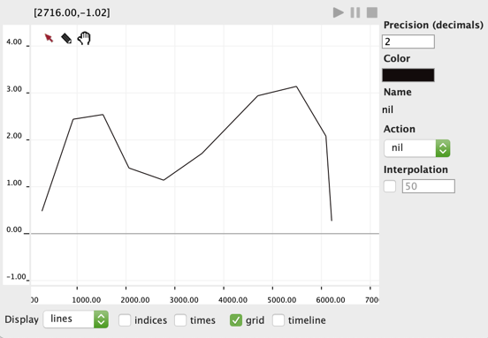 

- **Histogram**

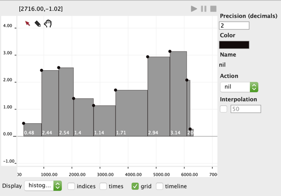 

### Edit Modes 

 

> Use <kbd>Tab</kbd> or click on the icons at the top of the BPF view to switch between three edit/interaction modes:

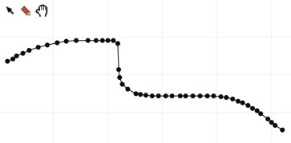 

- Standard "Mouse" mode: 
  - Use <kbd>Ctrl/⌘</kbd> + click to add point. 
  - Select and drag points or sets of points using rectangular / "rubber-band" selection.    
  (Use <kbd>Shift</kbd> + click to add/remove points to/from multiple selection). 
  - Select the whole function by clicking on a segment between two points in the "line" view modes. 

- Draw / "Pen" mode: 
  - Click and draw on the view.
  - Use <kbd>Ctrl/⌘</kbd> with mouse interactions to make "standard" point selections. 

- "Hand" mode: 
  - Move within the view without editing. 
  - Double-click to zoom out completely

> In standard or "Draw" modes, double-clicking on a point allows to set its precise X and Y values in a dialog box.
>
> 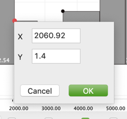 

### Keyboard shortcuts

- In general, use the  <kbd>&larr;</kbd> <kbd>&rarr;</kbd> <kbd>&uarr;</kbd> <kbd>&darr;</kbd> arrow keys to move points, <kbd>backspace</kbd> or <kbd>Del</kbd> to remove them.

- Zoom in/out with <kbd>+</kbd> / <kbd>-</kbd> 

#### "Edit" menu commands:

- Use the <kbd>Ctrl/⌘</kbd> + <kbd>A</kbd> shortcut for "Select All" (and select all points in the BPF)

- Use the <kbd>Ctrl/⌘</kbd> + <kbd>R</kbd> shortcut for "Reverse" (and reverse 
the order of the BPF points).

- Use the <kbd>Ctrl/⌘</kbd> + <kbd>Z</kbd>  / <kbd>Ctrl/⌘</kbd> + <kbd>shift</kbd> + <kbd>Z</kbd> shortcut for "Undo" / "Redo" commands.

## A playable `time-sequence`

A `BPF` in also a [`time-sequence`](time-sequence): the x-axis can be considered as time (in milliseconds) and each point in the BPF can be considered as an object in time. It is therefore possible to edit the temporal/horizontal dimension of the BPF using a [timeline view](time-sequence#timelin-editor).

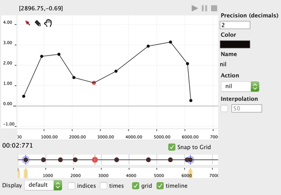 

The "times" check-box in the visualization options allows to display the time in millisecond if each point in the BPF.

### Play

It is also possible to _play_ a BPF, using the standard play/pause/stop controls in the editor, or corresponding shortcuts in the patch editors.
The `BPF` display paints the BPF contents in red as it passes through the play cursor.

Playing a `BPF` generally makes sense when the object is associated to an **action**, performed with each point at rendering time (see below).

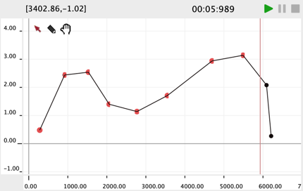

### Actions

Several actions are available by default:

- `print`: Just prints the point values (mostly useful for tests or debug).
- `send-as-osc`: Specify an OSC address, a target IP and a port number to send the point values as [OSC](osc).
- `midi-controller`: Select a MIDI controller number, channel and port number to use the BPF values as [MIDI](midi) continuous controllers.
- **Other:** enter a function name, or connect a lambda-function of one argument: the pair (x y) of points to which the function will be applied for "playing" the point. Alternatively, a list can be provided to specify a function of more than a single argument, along with its additional argument values). 

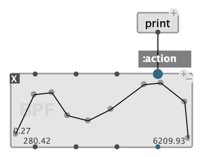 &rarr; &rarr; &rarr; 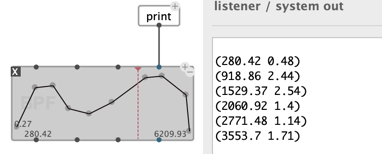

> #### Example: Send BPF values as OSC 
>
> Select the predefined action / Set the OSC parameters
>    
> 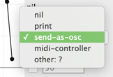 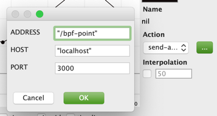    
>
> Play!   
> 
> 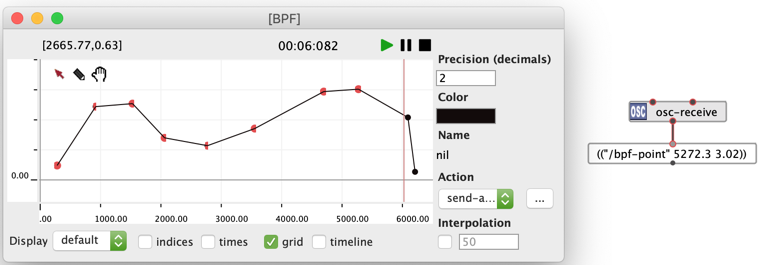    

### Interpolation

An interpolation value can be set from the [box attributes inputs](objects#box-attributes-inputs) or from the general properties panel of the BPF editor.

The interpolation is an interval specified in milliseconds.
When activated, the it generates intermediate points separated by this ti,e interval between each point of the BPF, and performs the selected action at the corresponding times.

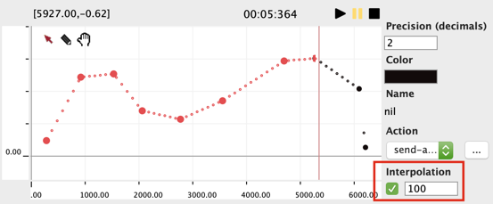

