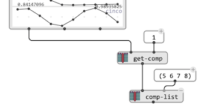

# `CLASS-ARRAY`

`CLASS-ARRAY` provides powerful means to set the contents of a 2D array. The array is initialized by a number of columns (called "fields") and a number of rows (called "elements", sometimes abreviated "elts").

> &rarr; See also [`2D-ARRAY`](2d-array) for a simple 2D data storage and representation utility.

The main parameters of the `CLASS-ARRAY` object are:
- `:field-names`: a list of names (stings), whose length will also determine the number of fileds, or rows in the array.
- `:num-elts`: an integer number determining th enumber of rows.

Given these two initialization parameters, each field can then be initialized individually using the box [keyword-inputs](box-inputs#keyword) (see below).

### Array field initialization

In order to set a  `CLASS-ARRAY` field, add a keywork input to the class and select the corresponding field name.

 

> **Note:** If the box was never evaluated before, the fields in `:field-names` might not be readily available from the keyword input choice. In this case (and in any case) it is also possible to create a field with the last option in the input menu, `:add field`.

Each field will be filled at evaluating the  `CLASS-ARRAY` box with the number of elements specified in `:num-elts`, according to a set of rules depending in the type of input data:

- **A list** provides a value for each element, and is repeated cyclically if shorter than `num-elts`, untill all elements have a value.

- **A simple value** is repeated `num-elts` times in order to fill all the elements.

- **A BPF** is sampled with `num-elts` values.

- **A lambda patch or function** is evaluated `num-elts` times with one argument (the element index: `0, 1, ..., num-elts`)

### Copy and transformation

When copying a `CLASS-ARRAY` to another box, it is possible to reset some of the box inputs and transform the array contents accordingly:

- Setting a new value for `:num-elts` will resize the array fields with another number of elements, cutting or cycling through the list as necessary.
- Setting a new list of `:fileld-names` will create a new set of fields and copy the existing ones (based on the field names) from the original array.
- Setting one of the fields individually using the corresponding [keyword-inputs](box-inputs#keyword) will change the values in this specific field.

### Data access

- `get-array-data` retrieves the full evaluated contents of the `CLASS-ARRAY` as a raw list of lists, suitable for processing through conventional Lisp structures and utilities.

- `get-field` returns the evaluated form of one specific field (from either a field name or index).

- `get-comp` returns an orthogonal view of the values of one columns/element in the array. Components are returned as instances of the `COMPONENT` structures, and can be accessed as raw values using the functions `comp-list` (all values) or `comp-field` (one specific field).

### In-pace modification

The functions in the package "Basic Tools / Class-Array and Components" include utilities for in-place, destructive modification of a `CLASS-ARRAY`. They all use the `COMPONENT` structure representing one column, or element of the array, as returned by `get-comp`, or created by `new-comp`. `add-comp` and `remove-comp` add or remove these components, while `comp-list` and `comp-field` both have an optional input allowing to replace the component values by new ones, inside the original array.

### Further reading and use cases

> `CLASS-ARRAY` as a data structure was designed and use mostly used in the [**OMChroma**](https://github.com/openmusic-project/OMChroma) project, as a control structure for sound synthesis processes.
>
> 
>
> &rarr; Read more in: [OMChroma: Compositional Control of Sound Synthesis](https://hal.archives-ouvertes.fr/hal-00683465/document).
