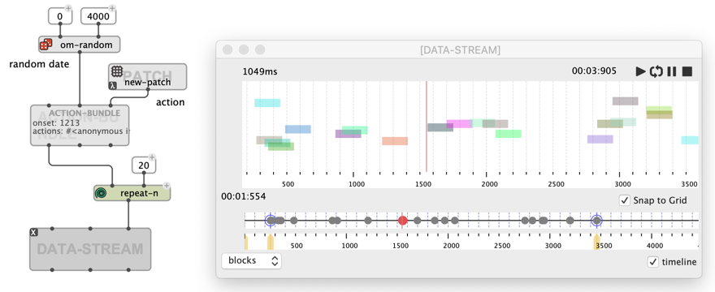
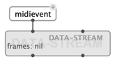
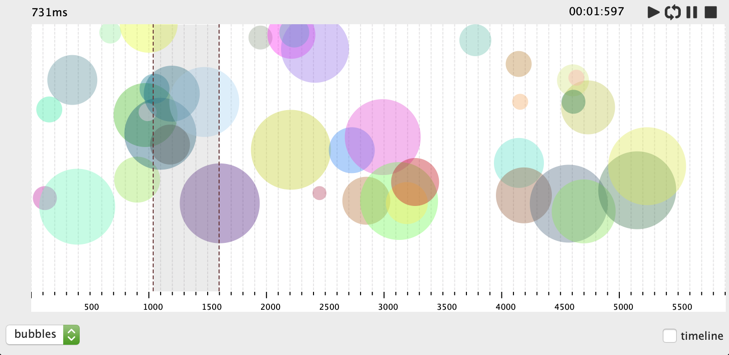
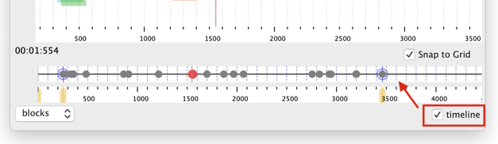

# `DATA-STREAM`

`DATA-STREAM` is a generic container for data to be arranged and executed in time.

> _`DATA-STREAM` and its associated editor are the base of numerous other objects and editors in OM#, such as [`MIDI-TRACK`](midi-track), [`CHORD-SEQ`](chord-seq), or [`SOUND`](sound). It is also used with advanced DSP structures, e.g. in the [IAE library](https://github.com/cac-t-u-s/iae).
But it can also be used on its own, as described on this page._

The `DATA-STREAM` object is constructed with a list of data frames: these can be of type `MIDIEVENT`, `MIDI-NOTE`, `CHORD`, `ACTION-BUNDLE`, `OSC-BUNDLE`, ... (all subclasses of the `DATA-FRAME` type).

The simplest data frame to use in a `DATA-STREAM` is the `ACTION-BUNDLE`. An `ACTION-BUNDLE` is constructed with a date (`onset`, in milliseconds) and an action, or list of actions (function names, box or patch in [lambda mode](lambda)).



The `DATA-STREAM` contains a sequence of such objects. It can be [played](player), dropped in a [Sequencer](sequencer), or edited by opening the data stream editor.

>  **Note:** In order to create an empty `DATA-STREAM` of a specific type of frames, set this type name (as a symbol) as the `self` initialization parameter of the `DATA-STREAM` box.

## Display and Editing

Data frames can be displayed as **rectangle blocks**, or as **circles ("bubbles")** (see chooser at the bottom-left of the editor).

By default they are assigned random vertical position, size qnd color; but these graphical attributes can be specialized by Lisp programmers by [redefining the folowing methods](lisp) for a given sub-type of `DATA-FRAME`:

```cl
(defmethod get-frame-color ((self my-data-frame-type)) (om-make-color _R_ _G_ _B_))
(defmethod get-frame-posy ((self my-data-frame-typee)) _Y_)
(defmethod get-frame-sizey ((self my-data-frame-type)) _H_)
```

> The class [`OSC-BUNDLE`](osc-bundle), for instance is diplayed as bubbles with a graphical attributes controlled in OSC messages `/y`, `/size`, `/color`.
>
> 

In the editor, data frames can be moved, copied, pasted, deleted using the ususal editor mouse and keyboard shortcuts.

They can be added (as empty frames of the same type) by <kbd>Ctrl/⌘</kbd> + click in the editor.


## Playback and Actions

`DATA-STREAM` is also a special kind of [time-sequence](time-sequence): a timeline editor allows to visualize and edit the temporal sequencing of data-frames.



The data can be played, looped on a specific segment, etc. (see [playable objects](player)): each frame executes an action when it is reached by the play-head.

> **Note:** Existing types of `DATA-FRAME` usually have predefined actions executed when played in a `DATA-STREAM`: Send MIDI events for `MIDIEVENT`, OSC messages for `OSC-BUNDLE`, etc.
