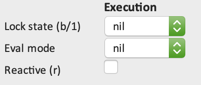
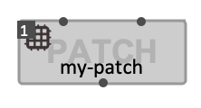
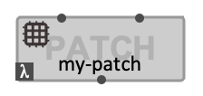
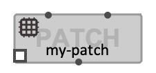

# Box State and Evaluation Modes

> Boxes in OM# have a _state_ determined by their **lock-state** and **eval-mode** attributes, wich determine the behaviour of a box evaluation by controlling respectively:
> * Whether or not should the box be evaluated and update its value;
> * What it should return.

Both attributes are accessible from the [inspector view](inspector).    
Seeting these attributes states change the appearance of the box by displaying little icons on its top-left and bottm-left corners.   

  

Some specific states can also be switched on/off using keyboard shortcuts (see details below).  

> _Not all states are available for all types of box._

> The state of a box is in fact also determined by the **reactive** attribute of the box, which brings up news cases where the box gets evaluated. See [Reactive Processes](reactive). 

------
## Lock State

The **lock-state** attribute controls whether or not the box should be evaluated when its value is requested.
There exist 3 different lock-states:

| Lock-state value | Shortcut | Evaluation behavior | Box icon |
|---|---|---|---|
|**NORMAL** (NIL) | | Default mode: the box is evaluated each time one of its output(s) value is requested.| — |
|**LOCKED** | <kbd>B</kbd> | **The box never reevaluates and just returns its current value.**   This state is used for instance when the current value of the box needs to be saved to avoid recomputations, or to avoid discarding manual edits in [object boxes](objects).| |
|**EVAL-ONCE** | <kbd>1</kbd> | **The box is evaluated _only once_ per global request,** (that is, per user evaluation request in a top-level patch, or per call to the container patch when inside a sub-patch or abstraction).  This is generally useful when the box has several outputs or several connections to some of its outputs.  **&rarr; See [Eval-Once](eval-once) for more details**. _Note that the eval-once mode is available only when option "auto ev-once" is NOT selected in the General [preferences](preferences)._| |

------
## Eval Mode

The **eval-mode** attribute controls the value that will be returned by the box.
There exist 4 different lock-states (not all available for all types of box):

| Attribute value | Shortcut | Evaluation behavior | Box icon |
|---|---|---|---|
|**NORMAL** (NIL) | | Default mode: the box is [evaluated](eval) normally, with input value(s) collected from upstream-connected boxes. | |
|**LAMBDA** | <kbd>L</kbd> | **The box returns _the function that it defines_.**  This is a very powerful feature of OM# allowing to easily get into graphical/functional programming.  **&rarr; See [Lambda Functions](lambda) for more details.**|  |
|**REFERENCE** |  | **The box returns its internal reference**, which can be a Lisp _generic function_ (for [function boxes](function-box)), a _class_ (for [object boxes](objects)), a _patch_ (for [abstraction boxes](abstraction)), ...  Input values are ignored and inlets/incoming connections are disabled.  This mode is rarely used in practice, except for "meta-programming", e.g. inside the OM# [sequencer](sequencer).  |  |
|**BOX** |  | **The box returns itself** as a value.   Inlets are evaluated.    This mode is also rarely used in practice.  |  |
