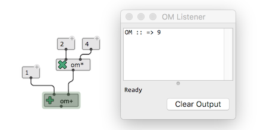
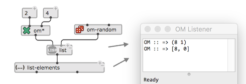
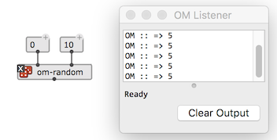
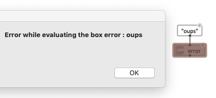

# Evaluation

**Evaluation is the essential mechanism of program execution in OM.**
Evaluating a box means requesting it to compute a value by applying a function to it's inputs. When the inputs are connected, the evaluation propagates to upstream connected boxes, until all requested values allow the computation of the box.

Use the <kbd>V</kbd> shortcut to evaluate the selected box(es) in the patch.

During evaluation, the box gets highlighted with a light-green frame.

When the evaluation terminates, the result is printed in the [Listener](listener). Use <kbd>Ctrl/⌘</kbd> + <kbd>shift</kbd> + <kbd>L</kbd> , or open the listener pane in the patch editor with the button  if it is not visible.

 

> **Note**: Boxes with multiple outputs are called "multivalued". Their result is displayed in the Listener as a list of values separated by comas.    
> 
>       
_**list** outputs a single "value": the list (0 8). **list-elements** outputs two separate values (0 and 8)._

Alternatively: 

- <kbd>Ctrl/⌘</kbd> + click on a box output to evaluate the box and print the value of this particular output.
- <kbd>Ctrl/⌘</kbd> + <kbd>shift</kbd> + click on a box output to evaluate the box and materialize the output as a new box.
- <kbd>Ctrl/⌘</kbd> + <kbd>shift</kbd> + <kbd>alt/option</kbd> + click on a box output to materialize the output as a new box and connect it to the output.

> **Note:**  <kbd>shift</kbd> + <kbd>I</kbd> reinitializes the box value – this is useful essentially for [object boxes](objects).

------
## Lock state / evaluation mode

Boxes can be set in special _states_ determining their behaviour at evaluation.
The state can be set using keyboard shortcuts or from the box [inspector](inspector).

For now, we will say that the box can be locked / unlocked with <kbd>B</kbd>:\\
**When a box is locked, no evaluation occurs and the box just returns its current (last-computed) value.**

 

> **See more in [Evaluation Modes](eval-modes).**

------

## Abort

You might want to abort an ongoing evaluation, either because it gets too long, or because something wrong happened (e.g. an uncaught error -- see below).

Use the "Edit/Abort Evaluation" menu command [ <kbd>Ctrl/⌘</kbd> + <kbd>shift</kbd> + <kbd>A</kbd> ] menu to abort an evaluation. 

------

## Errors

There's a lot of possible reasons why a evaluation box evaluation can lead to an error !

- A deliberate error-report from one of the evaluated module/submodule (e.g. "x should be greater than 0")
- A patch construction error (e.g. "You have tried to add characters instead of numbers")
- Bugs in OM or in your own / your library code.
- Etc.

The option "Handle error messages" in OM's General Preferences allows you to limit the consequences of such error being thrown by an executing OM program (when possible!), by displaying up a simple error message on a pop-up window. If this occurs, the box responsible for the error will be highlighted in red. 

 

Dismissing from the error will exit from the error and abort the current execution.

 

If for some reason an error occurs that is not aught by OM's error reporting system, you can still abort the process with <kbd>Ctrl/⌘</kbd> + <kbd>shift</kbd> + <kbd>A</kbd>.

