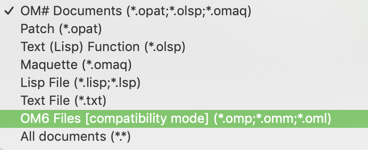

# Importing patches from OpenMusic 

 

Importing OpenMusic patches in OM# is relatively straightforward.
The "Open" command in the "File" menu proposes the "OM6" file format amongst the different supported file types.

> The "Open Folder" menu also allows opening a whole set of patches or OM#/OpenMsic documents at the same time, regardless of their types.

OpenMusic patches (.omp), maquettes (.omm) or Lisp functions (.oml) are automatically converted into OM# equivalent document and registered in the [document manager](doc-management), where they display as new, un-saved documents. 

They can be saved to the disk as new OM# (.opat, .omaq, .olsp) files, using the standard "Save" command <kbd>Ctrl/⌘</kbd>+<kbd>s</kbd>, or using the "Save selection" button in the "Documents" tab of the [Session window](session#the-document-tab).
