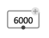

# Interface Boxes

Interface boxes facilitate the interaction with visual programs, either for selecting/setting input or intermediate values, to trigger actions or to control the computation flow.
They usually (but not necessarily) work along with [reactive visual programs](reactive): user actions on interface boxes trigger notifications to downstream reactive connections.

> Actions on the interface boxes can be performed by **mouse clicks/mouse drag using the <kbd>⌘</kbd> (MacOS) or <kbd>shift</kbd> + <kbd>Ctrl</kbd> (Windows, Linux) keys**.
> They can also be performed **with simple mouse clicks and drags (without a modifier key) when the patch is [locked](patch#lock)**.

Each interface box has different characteristics that can be set either trough a set of optional ["box-attributes"](objects#box-attributes) inputs, or via the [inspector](inspector) panel.

## Sliders

The `slider` box provides a convenient way to pick a value withing a given range. 
Minimum value, maximum value, increment and number of decimals, as well as the orientation of the slider (`:vertical` or `:horizontal`) can be set from the inspector panel or using the optional "box attribute" inputs of the `slider` box. 

The current value can also be set using the **value** input.

> #### Number box
> 
> A simple value box containing a number (integer or flat) is automatically turned into an interactive number box, whose value can be changed by dragging up or down with the mouse (and either <kbd>Ctrl/⌘</kbd>, or patch [locked](patch#lock)).
> Each value change triggers downstream reactive updates.
>
> #### Note box
> 
> The `NOTE` object box is also considered an interface box, as its value can be set and modified using a simple click and/or dragging up and down with the mouse (and either <kbd>Ctrl/⌘</kbd>, or patch [locked](patch#lock)). 
> Each value change triggers downstream reactive updates.

## Check-box

The `check-box` simply returns `T` or `NIL` depending on whether it is checked or not, and can be checked/unchecked with a simple click. 

## Button

The `button` box allows triggering the execution of visual programs with a mouse-click interface.
By default, the value of the box is `NIL`, and becomes `T` when the button is clicked.

It can be decorated with a **text**, ans assigned a specific **send-value** that is set instead of `T`, and pushed to the output when the button is pressed. 

## Switch

The `switch` box provides a simple interface to select between different value to connect somewhere, avoiding the need to disconnect/reconnect the corresponding outputs.

The box can be added as many inputs as desired, and displays corresponding boxes that can be clicked to select one of the inputs.

The **multiple-selection** attribute can be set from the inspector panel. In multiple selection, `switch` evaluates to the list of selected inputs.

## List selection

The `list-selection` box displays and allows selecting one or more items from a list of choices.
The size and font of the list cells can be set from the [inspector](inspector) panel, as a **multiple-selection** option, and an **output-mode**.  

Items are selected/deselected by clicking on the corresponding row of the list.
If **multiple-selection** is on, several items can be selected at a time, and returned as a list from the `list-selection` box output.

The **output-mode** determines whether the output should contain the **value**, or the **index** (starting with 0) of the selected item in the list. 

## List menu

The `list-menu` box has a similar purpose as `list-selection`, but displays the the list of choices as a drop-down menu.  

The **output-mode** also determines whether the output should contain the **value**, or the **index** (starting with 0) of the selected item in the list. 

