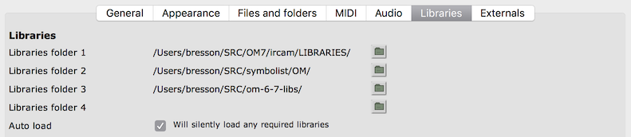
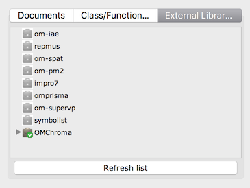
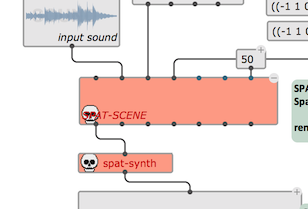

# External libraries

> **External libraries** are packages, or pieces of Lisp code that can be loaded dynamically in an OM# session.

Libraries must be located in specific folders where OM# can find them !     
&rarr; Set one or several locations in the **Libraries** tab of the [Preferences](preferences) window:

The **External Libraries** tab of the [Session Window](session) displays the libraries that are currently detected. This tab should update along with your modifications in the Preferences' search paths (but you can also help it with the "Refresh list" button!).
The "Refresh list" button is also useful to update the view when changes are made inside the folders while OM# is running.

Notice the different icons for libraries that are loaded, and not loaded:

> **Warnings:**     
> Beware of duplicate libraries in the different folders. Only one of them (first found!) can be loaded.
> Warning: GitHub users/downloaders -- when downloading a repository (say, for the library "my-lib"), GitHub may append the name of the branch to the downloaded packages ("my-lib-master.zip", etc.), preventing the lib to be recognised by its original name. Just rename the folder after downloading it.

> **See also:** [How to write a library](write-library).

#### Loading a library

Just double click on the library icon to load (or re-load) a library.

#### Patches requiring libraries

Patches created with objects or functions from an external library will need this library loaded in order to run and display correctly. 

Under certain condition (depending on how the library is, and which tools of the library are used -- see [How to write an external library](write-library)) the patch components can "remember" which library they depend on.  If this is the case and the required library is installed/detected but not loaded at opening a patch, a prompt will open proposing you to load it.

> The "Auto load" option in the Libraries preferences (see screen above) allows to load the required libraries silently as soon as the are needed. 

If the library is not loaded or not found the corresponding boxes will be temporarily disabled, and display in red in the patch.

**Note:** If the library is loaded or updated _after_ the patch, use the command **Revert (Last Saved)** from the file menu to reload the patch from the disk, and get the right boxes back in the patch.

