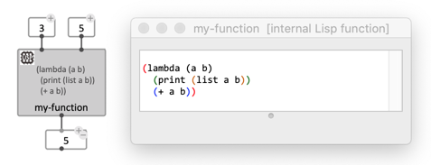

# Lisp-Function Box

OM# "Lisp function" boxes are specific types of [abstractions](abstraction) written directly in Lisp as a _**lambda expression**_.
Like a patch-abstraction, they can be [internal](abstraction#internal-abstraction) (created inside a patch editor) or [global](abstraction#global-abstraction) (stored as a separate file).

Lisp functions can be created with the _File/New/_ menu.    
They are saved as **.olsp** files which can be used as _[global](abstraction#global-abstraction)_ abstractions.

_[Internal](abstraction#internal-abstraction)_ Lisp functions can be created from the _Box/Add Box..._ menu or typing **`lisp`** in the same text field you would use to type a function or class name (displayed with double-click or using the <kbd>N</kbd> keyboard shortcut).  


## Lambda expression

> A lambda expression is just the way of defining a function in Common Lisp, without binding it to a specific name.

The basic syntax is :

```
(lambda (arg1 arg2 ...) 
   ; ... do things
   return-value)
```

In the Lisp function editor the usual syntax of Common Lisp applies.    
Lines starting with `;` are comments (ingnored).

`arg1`, `arg2`, ... are the "arguments" or parameters of the function. 
They will correspond to the inputs of the abstraction box.
The `return-value` will be read from the box output (Lisp-function boxes can have only one output).


 


