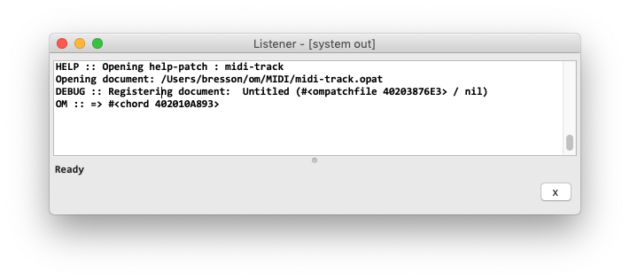
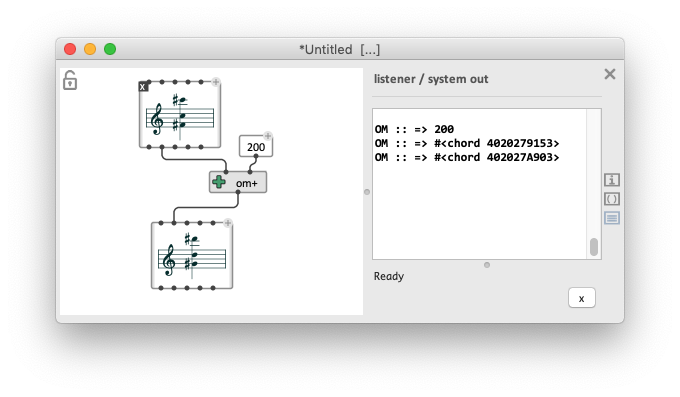
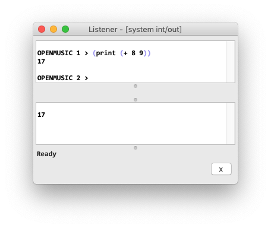
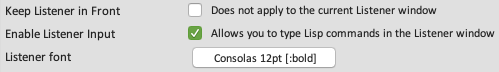

# Listener

The Lisp "Listener" is the main interface with the underlying Lisp environment. 
It is where messages and results of program executions are printed out from the environment, and therefore a useful source of information to understand what is going on (and eventually, what is wrong) when working with OM(#).

### Listener.s

The Listener output is present at different places in OM#:

- The main **Listener Window** can be popped-up and/or brought to front at any time from the "Windows" menu or using the <kbd>Ctrl/⌘</kbd> + <kbd>shift</kbd> + <kbd>L</kbd> short-cut.

- The [Session window](session) includes a "Listener tab". [ <kbd>Ctrl/⌘</kbd>+<kbd>shift</kbd>+<kbd>W</kbd> ]

- A Listener pane can be attached inside the [patch editor](patch) windows using the button , the menu "Edit/Show Listener Output" or the <kbd>Ctrl/⌘</kbd>+<kbd>M</kbd> short-cut.

> **Notes:** 
> - These views are all displaying a unique, global output stream.
> - Delete the current contents of the Listener output using the <kbd>X</kbd> buttons.

### Input Lisp Commands in the Listener

When the option "Enable Listener input" is on in the general [preferences](preferences) (see below), the main Listener window actually displays two panes. The one on top allows you to **input** commands (in Common Lisp) to the underlying environment. 

### Other Listener options

A few options in the "General" section of the [preferences](preferences) concern the Listener window:
- Keep the Listener window to front (on top of all other windows)
- Activate Listener input (see previous section).
- Font selection for the Listener pane

