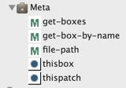

# Meta-visual programming

> We call "meta-programming" the fact for a program to consider other programs (or itself!) as data.
In a visual program, this would be a patch, or a box processing its own contents (or another patches' contents).
This is notably useful when creating advanced processes with the OM _maquette_ (or [sequencer](sequencer) in OM#): boxes can for instance position themselves (in time) according to some internal or external parameters.

## "Meta" input boxes

The "Meta" package provides two main functions, and a number of utilities to access from a given patch, the patch itself, or the box containing and executing this patch.

- **`thispatch`**
- **`thisbox`**

> See [this example](slots#a-use-case-of-setting-slot) using **`thisbox`** with the [`SLOTS`](slots) tool.

## Sequencer

The "Sequencer" package provides additional meta-visual programming tools applying specifically to the [sequencer](sequencer-programming) context.

- **`thissequencer`** is an extension of **`thispatch`** providing access to the container sequencer of a patch or sub-patch (including the sequencers "control patch").

> See: [Sequencer (Programming)](sequencer-programming)
