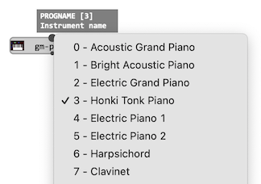

# Important MIDI Concepts

This page introduces some important concepts and terms used in MIDI features and documentation.

> &rarr; See more in the [official MIDI specification](https://www.midi.org/specifications/). There's alo many other simplified versions of it all over the internet!

## Events

MIDI is all about sending and receiving messages called **events**: a MIDI event is a data structure including a **type** (e.g. `KeyOn`, `KeyOff`, continuous controller, program change, etc.), a **channel** number, and a sequence of **values**. 

When a musical structure is [played](player) in OM#, it is ususally converted into a sequence of MIDI messages/events, which are scheduled and sent to a synthesizer (see [Sending MIDI](midi-out)). [Saving as MIDI](midi-save) also stores this sequence of events in a file.

## Notes

There is actually no such thing as a "MIDI note": A note is defined by the succession of a `KeyOn` and a `KeyOff` events, which correspond to the activation and release of a given "key" (as on a piano keyboard). 
The **values** of `KeyOn` and `KeyOff` events are:
- a _key_ number, which determines a pitch of the note. In the MIDI convention, 60 is the middle-C, 61 is C#, 62 is D, etc. 
- a _velocity_ (value beween 0 and 127). 

The time span between a `KeyOn` and a `KeyOff` event of a given pitch defines the duration of the note.

> Sometimes `KeyOff` events are not used in MIDI files, and replaced by `KeyOn` events with velocity = 0.

> `Note` can occasionally appear as a type of event in OM# (see [`MIDIEVENT`](midi-events)). This is a convenience shorthand, internally converted into a pair of `KeyOn`-`KeyOff` events.
 
## Channels

Most MIDI events apply to a specific **channel**. The MIDI standard limits the number of channels to 16.

For events that are not channel-specific, the channel number is ignored.

> Channel 10 is usually reserved from drums.

## Control Change

Continuous controllers are settings that can be sent to a MIDI synthesizer, usually through messages of type `ControlChange`. `ControlChange` messages apply to specific MIDI channels. The type of control as well as the setting value are given as message parameters (or "values"), both given in the range 0-127.

> &rarr; See [Continuous Controllers in OM#](midi-cc)

## Program Change

Program Change messages (or `ProgChange`) assign a specific instrument (or "program") to a given channel.

> The ["General MIDI" standard](https://www.midi.org/specifications-old/item/general-midi) defines a list of 128 timbres and sound which can be used to choose the desired sound on compatible synthesizers. 
> 
> The  `gm-program` box in OM# enables retrieving the program number corresponding to this list:  
>
>  

## Pitch Bend

Pitch Bend is a special type of MIDI message, specifying a pitch alteration for a given channel, usually in the range of ± 2 semitones. Pitch bend values are specified with values in the range of 0-16383 (14 bits), with the middle range (8192) meaning no alteration.

> OM# utility function `mc-to-pitcwheel` converts a given amount of midicents into the adequate pitch bend value.

**Important: `PitchBend` applies to all events on a given channel. It is not possible to change the pitchbend for a single MIDI note or key.**

> Bending the pitch of specific MIDI channels is used in OM# in order to render microintervals. To do so, notes in quarter- or eight-tones must be set to play in dedicated channels. See [Microinterval Settings](microintervals) for details.

## Tracks

The Standard MIDI File format allows organizing MIDI events in "tracks": a useful concept to separate voices, or instruments in scores or DAWs in general. 

> There exist two main formats for MIDI files :
> - Format "0" contains a single track containing all MIDI events.
> - Format "1" may contain separated tracks tracks.

There can be any number of tracks, and events of any channels can be included in any track. The track is however just a structural info which is not transmitted to MIDI synthesizers. A control change event sent to a given channel, for instance, will have an effect on the synthesizer's settings for this channel independently of the track where this event was assigned.

> Track #0 is often dedicated to **tempo and time signature** events, which apply to all tracks.